By now we already know what vectors and matrices are. 

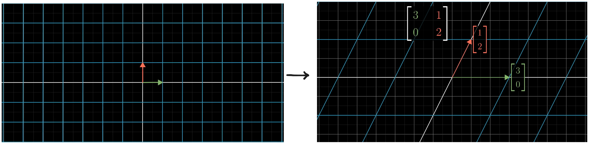

Matrix is simply a numerical representation of linear transformations. Here if we have a vector

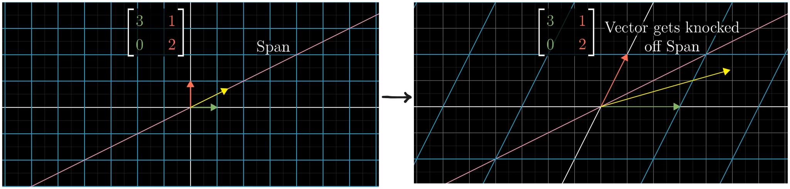

Here if we take a span which passes through origin and tip of the vector, after the linear transformation for most of the cases the vector gets knocked off its span. 
But there are few vectors that does not get knocked off :

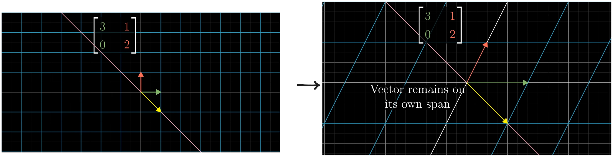

here if we see,
- the vector $\begin{bmatrix}1\\-1\end{bmatrix}$ does not get knocked off from the span joining the tip of vector and origin instead only gets stretched to $\begin{bmatrix}2\\-2\end{bmatrix}$ .
- another vector that does not get knocked off is the vector in $\hat{i}$ i.e., $\begin{bmatrix}1\\0\end{bmatrix}$ it only get stretched to $\begin{bmatrix}3\\0\end{bmatrix}$ .
After the linear transformation, not just those two, any vector existing in those respective spans does not get knocked off. 

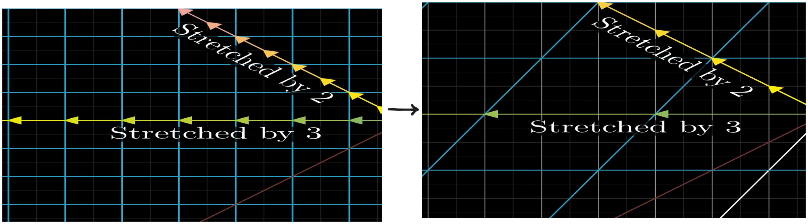

This very special vectors that does not get knocked off from the span joining the tip of vector and origin (line of action or one dimensional subspace spanned by the vector) are called ***eigen vectors of the transformation.*** Or vectors whose direction does not change after transformation.

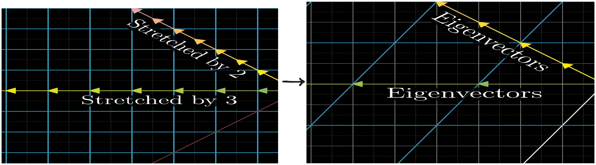

And the value by which the eigenvectors get stretched or squished is called ***eigenvalues of those eigenvectors.*** 
The eigenvalues can also be negative if the transformation results in flipping of the eigenvectors then it becomes negative.

>[! Note]
>Symbolically, an eigenvector can be shown as 
>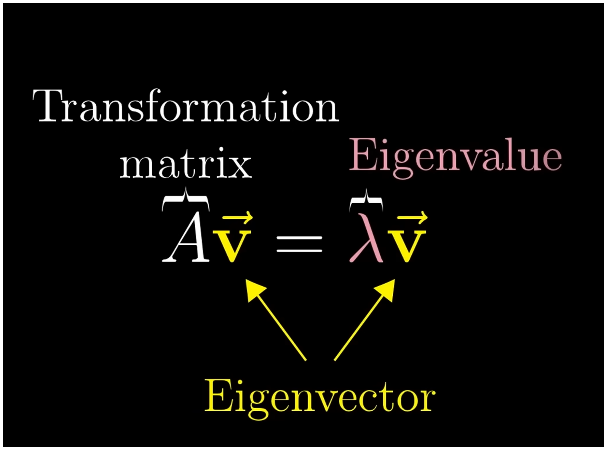
>Here its simply saying if we apply a linear transformation with matrix $A$ on vector $\vec{v}$ the result is simply the same vector $\vec{v}$ getting stretched or squished by a factor (eigenvalue) of $\lambda$.
>

## Finding eigenvectors and eigenvalues

From previous equation of $A\vec{v}=\lambda\vec{v}$ here left side is a matrix multiplication whereas right side is a scalar vector multiplication so instead it would be better if we made both sides as matrix multiplication. To do that we can turn the scalar $\lambda$ to a matrix which has the effect of scaling the vector by $\lambda$ amount.
$$
	\begin{array}{c}
	A\vec{v} = \lambda\vec{v} \\
	\text{here we can write } \lambda = \begin{bmatrix}
	\lambda&0&0\\0&\lambda&0\\0&0&\lambda
	\end{bmatrix} \text{this matrix simply scale vector by }\lambda \text{ amount}  \\
	\lambda=\lambda \begin{bmatrix}
	1&0&0\\0&1&0\\0&0&1
	\end{bmatrix} \text{here the matrix os simply an identity matrix I}\\ 
	A\vec{v}=(\lambda I)\vec{v} \\
	A\vec{v}-(\lambda I)\vec{v}=0 \\
	(A-\lambda I)\vec{v}=0
	\end{array}
$$
Now we have two case :
- vector $\vec{v}$ can be zero which is always true.
- The matrix multiplication with non-zero vector result in 0. We know this is only possible if the linear transformation causes the space to squish to a lower dimension. or $\det(A-\lambda I)=0$ .
Now we already know the value of matrix $A$ . So here we can easily find the value of eigenvalue $\lambda$. With that eigenvalue/eigenvalues we can find the eigen vectors.
Lets take same transformation from before 

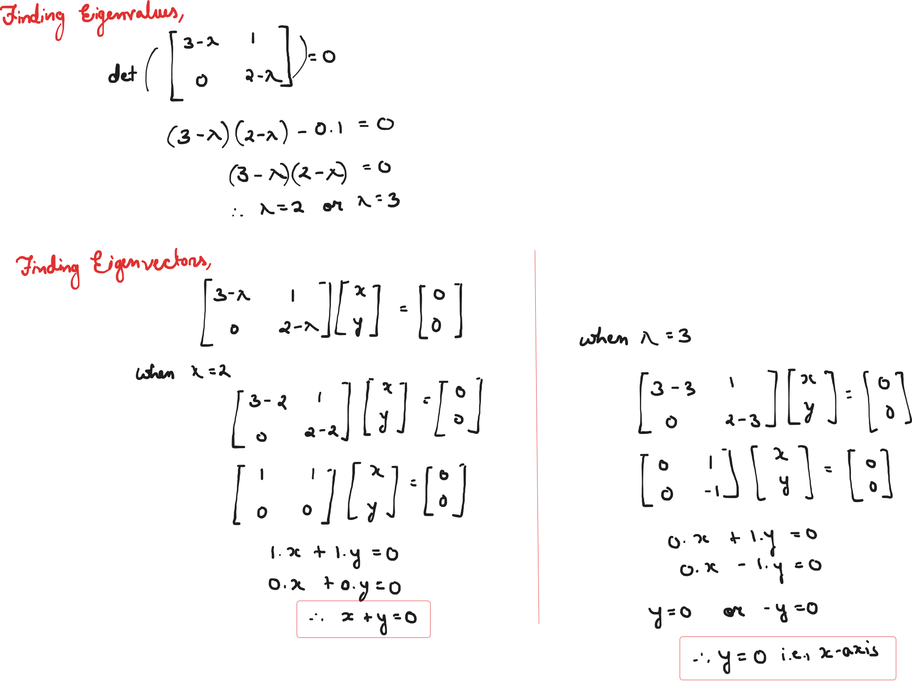

All transformations does not necessarily have to have eigenvalues and eigenvectors. For example, if we do a rotation transformations (except $180^\circ$ and $0^\circ$) in 2D space all vectors change its direction resulting in no eigenvalues and eigenvectors.

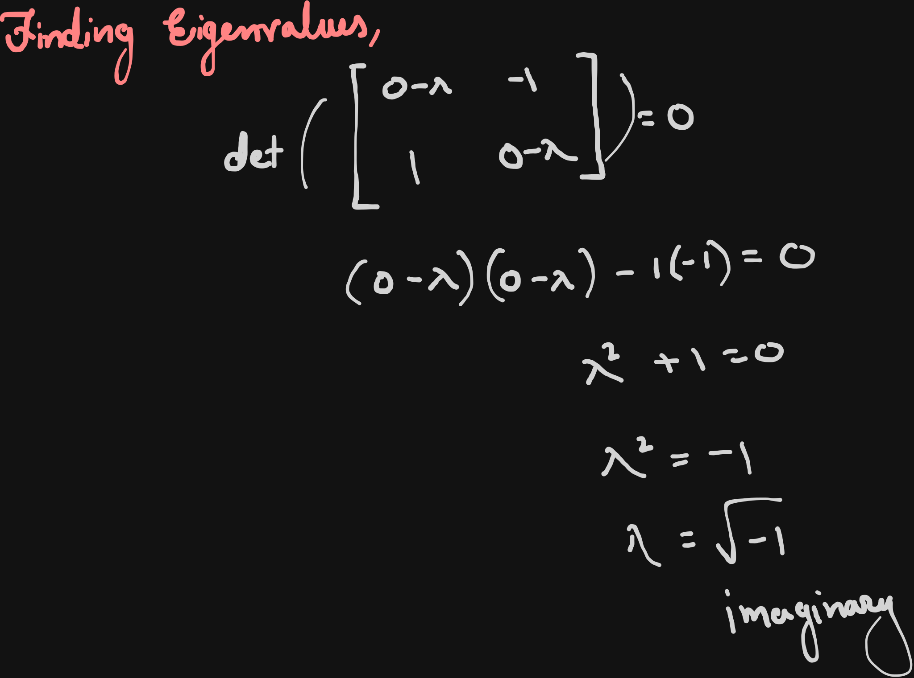

if we try to find eigenvalues we get an imaginary value.
We can also have a single eigenvalue but many eigenvectors as,

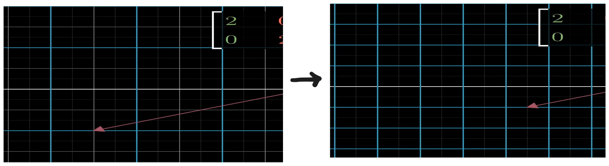

>[! Important]
>For a linear transformations, it can have single eigenvalue and multiple eigenvectors but cannot have multiple distinct eigenvectors and single eigenvalue.
>A linear transformation in 2D plane cannot have any number of unique eigenvector directions. It can only have :
>1. no eigenvectors, when $\det(A-\lambda I)$ give imaginary value.
>2. 1 eigendirection, when $\det(A-\lambda I)$ give imaginary exactly one value.
>3. 2 eigendirections, when $\det(A-\lambda I)$ give 2 distinct values.
>4. Infinitely eigendirections, when $\det(A-\lambda I)$ give repeated eigen value.

## Eigen Basis

After a linear transformation if we get 2 unique eigendirections. And if we make those eigenvectors as our new basis vectors it is called ***eigen basis***.

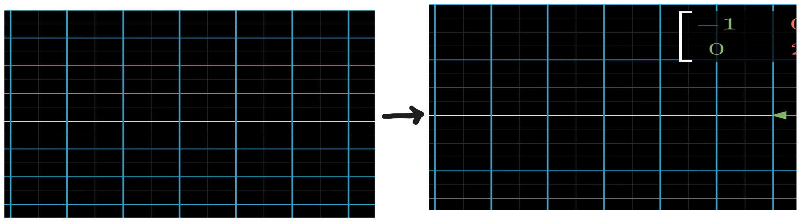

Now to change our basis vectors to new basis coordinate system( eigen vectors as new basis vectors) we would need to do a linear transformation the matrix formed is a diagonal matrix. Here the diagonal values are the eigen values.

>[! Important]
>when we have a matrix where all other values are 0 except for diagonals it is called ***Diagonal matrix.***
>$$
>	A=\begin{bmatrix}
>	5&0&0\\0&2&0\\0&0&-3
>	\end{bmatrix}
>$$
>Diagonal matrix basically show that all eigenvectors are basis vectors with eigenvalues sitting diagonally.
>Working with diagonal matrix is much easier as, if we do matrix multiplication with itself multiple times all it does is scale each basis vector by some eigenvalue.
>
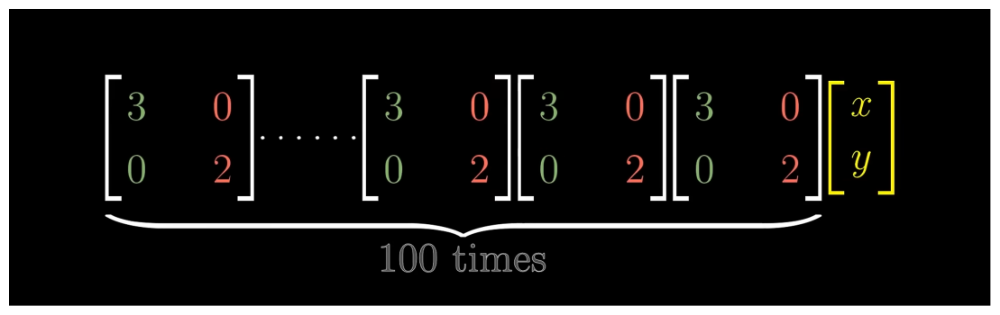
>this basically equal to
>
>$$
>	\begin{bmatrix}
>	3^{100}&0\\0&2^{100}
>	\end{bmatrix}\begin{bmatrix}
>	x\\y
>	\end{bmatrix}
>$$
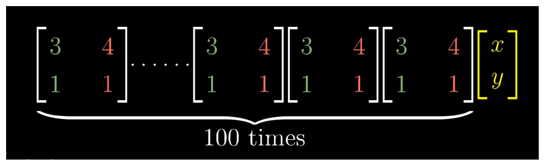
>If we try this matrix multiplication it becomes complex as $x$ and $y$ component get mixed up
>
>$$
>	\begin{bmatrix}
>	3*3+4*1&3*4+4*1\\1*3+1*1&1*4+1*1
>	\end{bmatrix}
>$$
>After few multiplication matrix becomes complex the main advantage of diagonal matrix is its predictability. We already know what will be the final matrix after 100 or 1000 multiplications.

