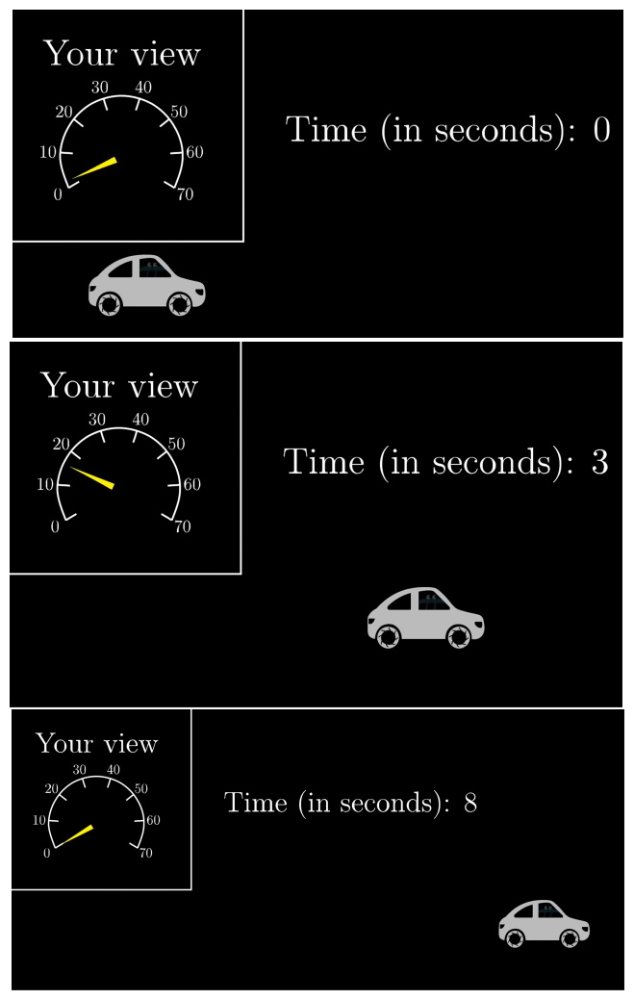
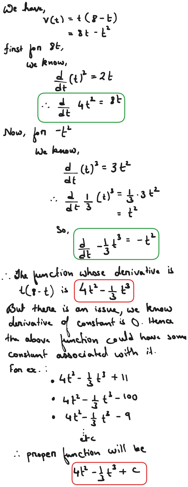
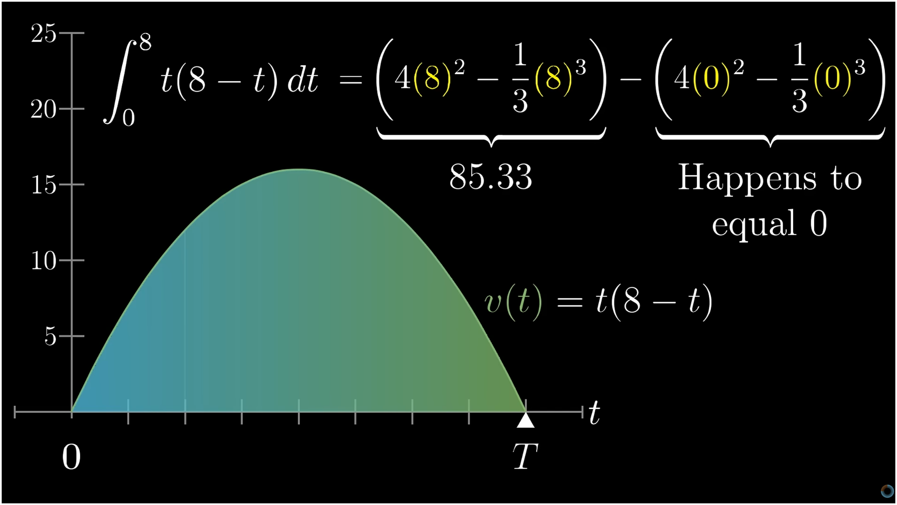

Lets say we have a car and the driver cannot see outside the car and can only see the speedometer, the car starts running , speeds up and slow down to stop. The whole journey was 8 sec. How far did the car go?  

If we draw the velocity time graph

here velocity is a function of time as t(8-t).
$$
	\begin{array}{c}
	\text{At t=0,} \\
	v(0)=0(8-0)=0 \\
	\text{At t=8,} \\
	v(8)=8(8-8)=0
	\end{array}
$$
This is opposite to what we did in derivative i.e., we knew distance travelled and needed to find velocity. For which we differentiated the distance function w.r.t t and the ratio gave us slope which is our velocity. The graph formed by the derivative of distance function at each point was our velocity graph.

Here because we already have the velocity graph we can say there must be a distance function which on being differentiated w.r.t time should give us the velocity graph.

$$
\begin{align}
\frac{d(???)}{dt}=t(8-t) \\
\text{Hence, we need to find antiderivative}
\end{align}	
$$

To make things easier lets assume the car was moving at constant velocity then velocity time graph would have been :

And the distance travelled is the area under the curve. Thinking of area as distance is kind of weird but because velocity has unit (m/s) and time has unit (s) when we multiply time factor get cancelled out and our answer comes in m. 

Our case is harder as the velocity is changing at every point of time, if again we assume that car run at constant velocity for certain interval of time and then jump to next velocity. This is practically impossible but if it was the case we could still solve the problem by finding the area for each interval

Following the same idea we will approximate the area by thinking area under the curve as small rectangular chucks of areas.

For smaller and smaller approximation we get more accurate area. Let us that take one small time interval to be $dt$ so at 

Now to find area under the curve we have two choices multiply $dt$ with 7.0 which will area a bit lesser than actual or multiply $dt$ with 8.4 which will give area a bit more than actual. But for smaller and smaller value of $dt$ it actually won't as both start approaching a single value. Now the area under the whole curve can be given as :

$$
	\begin{array}{c}
	\text{Sum of v(t).dt where v(t) varies, This same expression can be written as} \\
	\int_{0}^8v(t)dt \\
	\int\text{ symbol is called integral, as in integrating multiple value to one.}
	\end{array}
$$
Now in general we can say,

Here the area under the curve or integral of v(t)dt is nothing but distance - time function S(T). Now to find the antiderivative we break down our velocity function into smaller parts 

We can see adding constant just moves the graph but does not change the slope.  Now to find the area under the curve or the distance we simply replace the range at which we want to find the area. Here we want from 0 to 8. Hence

So the car travelled 85.33 m.
***
## Fundamental Theorem of calculus

This idea of finding the area under the curve at some range by finding antiderivative is called fundamental theorem of calculus

***
## Negative Values

If the car is moving backward integral can be negative

