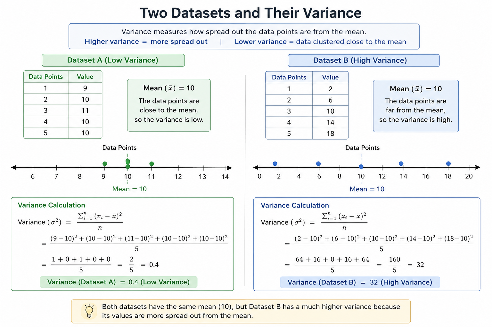
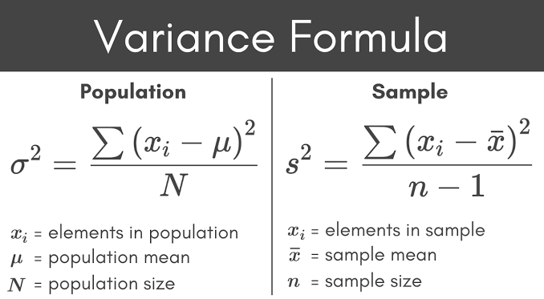

-  We need dispersion to see how data is distributed from the central point, If we have data $[-15, -10, 0, 10, 15]$ and $[-150, -10, 0, 10, 150]$. If we find central tendency
$$
\begin{align} 
Dataset_{1}&=[-15, -10, 0, 10, 15] \\
 \\
Dataset_{2}&=[-150, -10, 0, 10, 150] \\
 \\
	Mean(\bar{x}) &= 0 \\
	
	Median &= 0 \\
	
	Mode &= \text{no mode}
\end{align}
$$
- The measure of central tendency cannot differentiate between the two dataset , for it they look the same. But clearly the data in $Dataset_{2}$ is way more spread out than $Dataset_{1}$. Hence to show how data is from central point we use measure of dispersion.

## Range

-  **Range** tells you the **total spread** of a dataset from the smallest value to the largest value.
$$
	Range = max - min
$$
- Dataset A: $[9, 10, 10, 10, 11]$
$$
	Range = 11-9=2
$$

- Dataset B: $[2, 6, 10, 14, 18]$
$$
	Range = 18-2=16
$$
This immediately tells us that Dataset B is spread out much more than Dataset A.
### Then why do we need variance if range already shows spread?

Because range only uses **two numbers**:

- the minimum value
- the maximum value

It completely ignores all the other data points.

For example:

- Dataset C: $[1, 5, 5, 5, 9]$
- Dataset D: $[1, 1, 5, 9, 9]$

Both have:
$$
	Range=9-1=8
$$
But Dataset D is much more spread out than Dataset C.

Variance can detect this because it uses **every single data point** and measures how far each point is from the mean.

## Variance

- Variance tells us that on average how far are points from mean value.

- Why difference in formula ? explained in next note 
### Why square the difference ?
- Here our concern is only how far the values in dataset are from the mean position. $x_{i}-\mu$ could give us negative value. So dataset like $[-10, -6, -5, -4, 4, 5, 6, 10]$ 
$$
	\begin{align}
	\text{Dataset} &= [-2, 1, 2, 4, 6, 7, 10] \\
	\text{Mean} &=  4 \\
	\text{Deviations }x_{i}-\mu &= [-6, -3, -2, 0, 2, 3, 6]
	\end{align}
$$
- Here summation of deviation values give us 0. But deviation cannot be zero unless all values in dataset are same here which clearly is not. This error occur due to having negative values. To solve this we can use modulo operator or square the difference.
- Consider two datasets centered around 0:
	- A: $[-1, 1]$
	- B: $[-5, 5]$
Absolute deviations:
- A: $1+1=2$
- B: $5+5=10$
Squared deviations:
- A: $1^2+1^2=2$
- B: $5^2+5^2=50$
Squaring makes large outliers contribute much more, which is often useful because points far from the mean are more significant. Squaring the value penalizes the deviation more.
- We can also use modulo and if we do so and find deviation we call it ***Mean Absolute Deviation (MAD).
$$
	MAD=\frac{\sum|x_{i}-\mu|}{n}
$$
- In Machine learning or other statistical problems MAD is rarely used. As |x| is much harder to differentiate than $x^2$. And in ML differentiation is very important
$$
	\begin{align}
	\frac{d(|x|)}{dy}&=\frac{x}{|x|} \text{ , where |x| }\neq 0 \\
	\text{modulo is not differentiable at x = 0.} \\ \\
	
	\frac{d(x^2)}{dy}=2x \\
	x^2\text{ is differentiable at every point of x.}
	\end{align}
$$
## Standard deviation.

The square root of variance is standard deviation.
$$
	\begin{align}
	\sigma=\sqrt{ \sigma^2 } \\
	\text{or} \\
	S=\sqrt{ S^2 }
	\end{align}
$$
- When we find variance we square the values due to which the unit also gets squared, if we have a dataset of marks and find variance our answer will have unit $(marks)^2$ , which is unintuitive to understand. Hence doing $\sqrt{  }$ bring it back to marks which is much more intuitive as marks being on average standard deviation spread from mean.
- In real life use case we take standard deviation over variance.

## Looking back at example

$$
	\begin{align}
	Dataset_{1}&=[-15, -10, 0, 10, 15] \\
 \\
Dataset_{2}&=[-150, -10, 0, 10, 150] \\
 \\ 
	\text{for both,} \\
	Mean(\bar{x}) &= 0 \\
	
	Median &= 0 \\
	
	Mode &= \text{no mode} \\
	 \\
	\text{for }Dataset_{1}, \\
	Range &= 15-(-15)=30 \\
	Variance &= \frac{(-15-0)^2+(-10-0)^2+(0-0)^2+(10-0)^2+(15-0)^2}{4} \\
	&=162.5 \\
	Std. deviation &=12.75 \\
	 \\
	\text{for }Dataset_{2}, \\
	Range &= 150-(-150)=300 \\
	Variance &= \frac{(-150-0)^2+(-10-0)^2+(0-0)^2+(10-0)^2+(150-0)^2}{4} \\
	&=11300 \\
	Std. deviation &=106.3
	\end{align}
$$
- We can see $Dataset_{1}$ and $Dataset_{2}$ are vastly different from each other in terms of Range, variance and standard deviation.