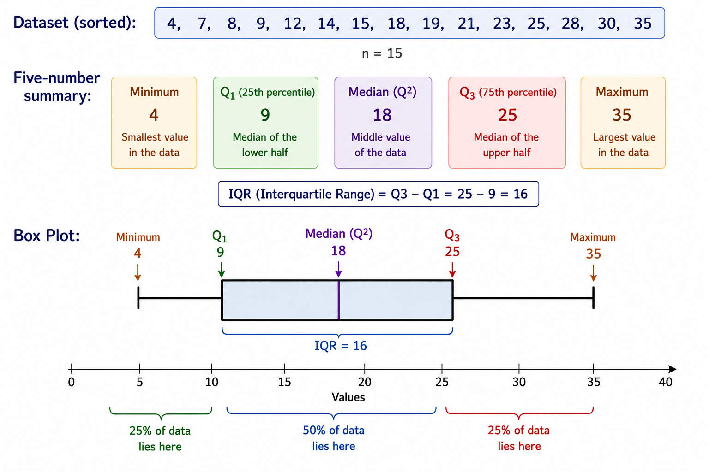
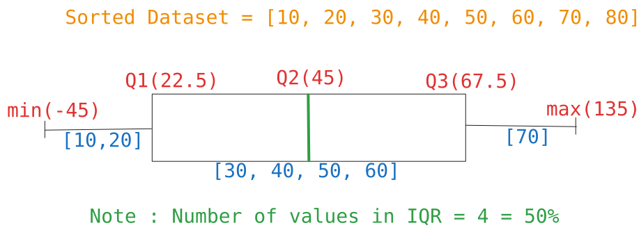

**IQR (Interquartile Range)** is a measure of how spread out the middle 50% of a dataset is.

### Definition
$$
	IQR=Q_{3}-Q_{1}
$$
where:
- **$Q_{1}$ (First Quartile)** = 25th percentile (25% of data lie below it).
- **$Q_{3}$ (Third Quartile)** = 75th percentile (75% of data lie below it).
- **$Q_{2}$ (median)** = Median of dataset.

Suppose we have the data:
$$
	Dataset = [2,4,5,7,8,10,12,15,18 ]
$$
$$
\begin{align}
\text{Median, }Q_{2}&=8 \\ \\

\text{Lower Half or 25th percentile,} \\
[2,4,5,7] \\ \\

\text{Upper Half or 75th percentile} \\
[10,12,15,18]
\end{align}
$$
Now, 
$$
	\begin{align}
	\text{Median of lower half, }Q_{1}=\frac{4+5}{2}=4.5 \\
	 \\
	\text{Median of upper half, }Q_{3}=\frac{12+15}{2}=13.5 \\
	 \\
	IQR=Q_{3}-Q_{1}=13.5-4.5=9
	\end{align}
$$

The IQR tells us **how spread out the central half of the data is**.
- Small IQR → middle values are tightly packed.
- Large IQR → middle values are spread out.
Unlike variance or standard deviation, IQR **ignores the extreme values (outliers)**.

IQR is commonly used to:
1. Measure spread in skewed data.
2. Detect outliers.
3. Build box plots.

## Outlier Rule (1.5 x IQR Rule)

$$
\begin{align}
\text{Lower bound} = 	Q_{1}-1.5*IQR \\
 \\
\text{Upper bound} = 	Q_{1}+1.5*IQR
\end{align}
$$
## Box Plots

- A box plot is also called whisker plot, is a powerful data visualization tool that provide summary of a numerical data distribution.
- It uses boxes and lines to depict the data distribution.
- Box limits indicates the central 50% data, with a central line indicating Median value.

## Calculating values

### Median $Q_{2}$

Dataset : $[30,40,50,10,20,60,70,80]$

Sorted value : $[10,20,30,40,50,60,70,80]$

Find rank using formula:  (n+1).P , where n = number of elements in 1-based index, value of P for $Q_{2}=\frac{1}{2}=0.5$ 
$$
	Rank = (n+1).p=(8+1).0.5=4.5
$$
- If rank value is integer we can directly take rank value as position of median. Here float value mean our median lie between position 4 and 5. we need to interpolate the values.  
Interpolating between values
$$
	\begin{align}
	Q_{2}&=x_{lower}+(fraction*(x_{upper}-x_{lower})) \\
	Q_{2}&=40+(0.5*(50-40)) \\
	&=45 \\
	\text{Hence, }Q_{2}=45
	\end{align}
$$

### First Quartile $Q_{1}$

Find rank : (n+1).p , here for $Q_{1}$ the value of p = 0.25
$$
	Rank = (n+1)*P=(8+1)*0.25=2.25
$$
Hence median of first quartile line between position 2 and 3.  
Interpolating the values 
$$
\begin{align}
Q_{1}&=x_{lower}+(fraction*(x_{upper}-x_{lower})) \\
Q_{1}&=20+(0.25*(30-20)) \\
	&=22.5 \\
	\text{Hence, }Q_{1}=22.5
\end{align}
$$

## Third Quartile $Q_{3}$

Find rank : (n+1).p , here for $Q_{1}$ the value of p = 0.75
$$
	Rank = (n+1)*P=(8+1)*0.75=6.75
$$
Hence median of first quartile line between position 6 and 7.  
Interpolating the values 
$$
\begin{align}
Q_{3}&=x_{lower}+(fraction*(x_{upper}-x_{lower})) \\
Q_{3}&=60+(0.75*(70-60)) \\
	&=67.5 \\
	\text{Hence, }Q_{3}=67.5
\end{align}
$$
### IQR

$$
	IQR=Q_{3}-Q_{1}=67.5-22.5=45
$$
- Here IQR 45 is saying the middle 50% of data span 45 units

### Minimum (min) / Lower bound

- Minimum does not represent the actual minimum value of dataset
$$
\begin{align}
min &= Q_{1}-1.5*IQR \\
&=22.5-1.5*45 \\
&=-45
\end{align}
$$
- In our above example no value is less than -45 but in some dataset there could be values lesser than minimum this values are called outliers.
### Maximum (max) / Upper bound

- Maximum does not represent the actual maximum value of dataset
$$
\begin{align}
max &= Q_{3}+1.5*IQR \\
&=67.5+1.5*45 \\
&=135
\end{align}
$$
- In our above example no value is greater than 135 but in some dataset there could be values more than maximum, this values are called outliers.