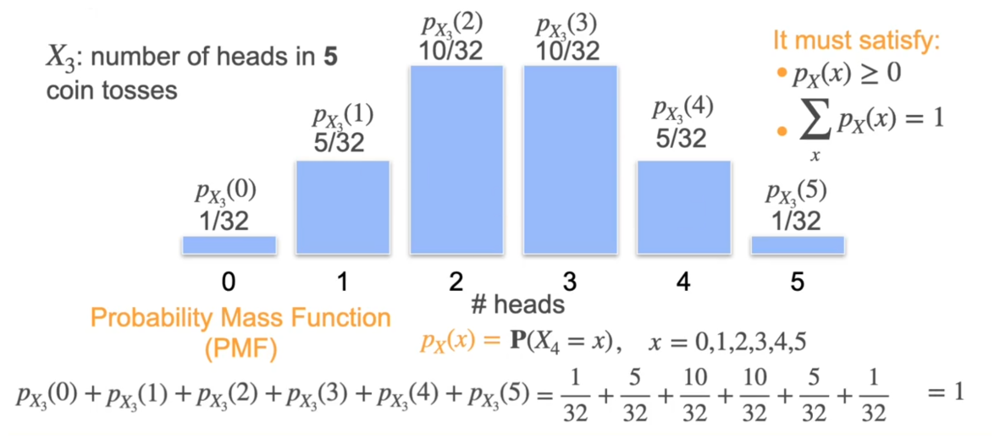

A **probability distribution** is the mathematical description of **all possible values** a random variable can take **and the probability of each value**.

Probability distribution is simply a definition which say the probability of each value of random variable can be represented in some sort of distribution.

For different types of experiments we can use different types of probability distribution to show how probabilities are distribution across various values of random variable. 

Let's take an example of discrete random variable event,  
we toss 3 coins now we took a random variable $X=\text{no. of heads obtained in 3 coin toss}$. Now here the possible values outcomes are :
- $X=0$ : no heads.
- $X=1$ : 1 head.
- $X=2$ : 2 heads.
- $X=3$ : 3 heads.
If we represent the distribution of each case :

probability distribution chart :

Similarly

To show the mathematical relationship between a value of random variable and the probability associated with it we need some function. Based on the type of experiments, we use different function to show the relation :
- Probability Mass Function (Used in discrete random variable events)
- Probability Density Function (Used in Continuous random variable events)
- Cumulative Distribution Function (CDF).
## Probability Mass Function (PMF)

A probability mass function (PMF) is a function that gives the probability that a discrete random variable is exactly equal to a specific value. It maps each distinct outcome to a valid likelihood.

$$
\begin{align}
X&=\text{no. of heads in a 5 coin toss} \\
P(X&=x),x\in{(0,1,2,3,4,5)}
\end{align}
$$

Looking at the values we can notice some pattern. Hence there must be some general formula which can give us the relationship between the probability and random variable. But this pattern changes based on the type of experiment we are conducting and the type of probability we are trying to find. So, by identifying the type of experiment we put the experiment in some distribution classes :
- Binomial Distribution
- Bernoulli Distribution
- Normal Distribution
- Poisson Distribution
- Uniform Distribution
...etc. Once we identify the type of distribution our experiment falls in, each distribution has its own predefined PMF (equation) with the help of which we can instantly find the probability of an event instead of looking at each and every outcomes, searching for favorable outcomes and dividing the value with total no. of outcomes (basic formula to find probability).
## Binomial Distribution

A **binomial distribution** is a probability distribution that tells us:

> **What is the probability of getting exactly x successes when we perform n independent trials, where each trial has only two possible outcomes?**

In general,

$$
	P(X=x) = \binom{n}{x} p^x(1-p)^{n-x}
$$
Here,
- $n$ is the no. of independent experiment.
- $x$ is the no. of time some event has to happen.
- $p$ is the probability of $x$ happening in 1 independent experiment.
The random variable defined above is solved with Binomial Distribution hence it is represented by

$$
	X\sim Binomial(n,p)
$$

For ex :

Other question :
- If 7 dies are rolled find the probability of getting sixes in 3 times.
- If coin is tossed 6 times , find the probability of getting atleast 4 heads. hint: simple sum the probability of $P(X=4)+P(X=5)+P(X=6)$ here $X:$ no. of heads in 6 coin toss.

## Bernoulli Distribution

This distribution is a simpler version of Binomial Distribution. In binomial we have PMF to find for n number of experiments, here we only see for one experiments.

