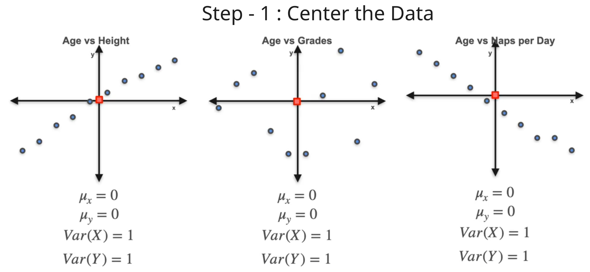
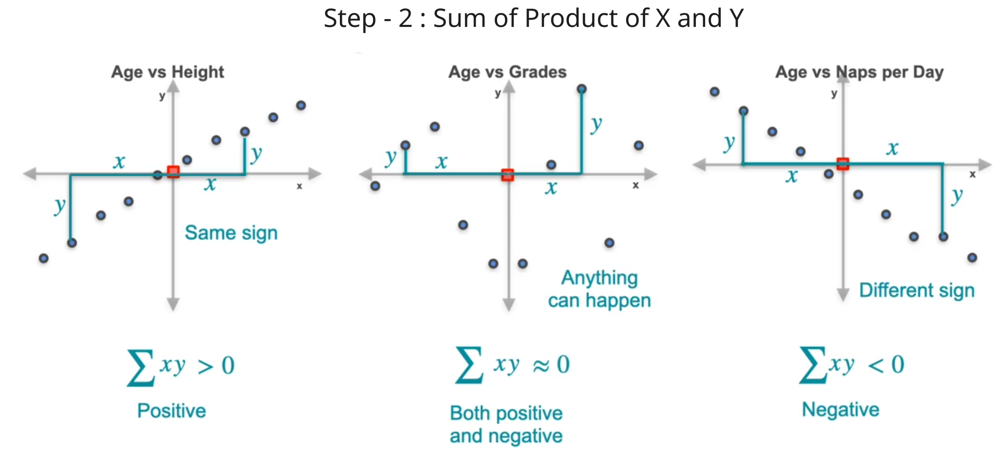

To see if we can differentiate between the 3 graphs we can view various statistical analysis

we see the mean and variance relation but does not seem to get able to differentiate between the graphs in concrete way.

Looking at the 3 initial graphs we can clearly see some pattern :
- $\text{Age VS Height}$ : Here the graph points is moving upward from bottom left to top right.
- $\text{Age VS Grade}$ : Here the graph points are all over the place.
- $\text{Age VS Naps per Day}$ : Here the graph points is moving downward from top left to bottom right.
This pattern can be caught with the help of ***Covariance***. 

Covariance is a statistical measure that shows if two variables move together. A positive number means they go up or down together. A negative number means when one goes up, the other goes down. Zero means they do not have a linear relationship

## Calculating the Covariance

Step - 1 : Center the Data  
First step is to center the data so that mean is at 0 and variance is 1

Step - 2 : Find the trend  
If we look at the graphs we can see three cases :
- Case - 1 (upward trend): As the x values move to right (positive), the y values also become positive and as x values move to left (negative), y values also become negative.
- Case - 2 (no trend) : Here the x and y values are all over the place.
- Case - 3 (downward trend) : As the x values move to right (positive), the y values become negative and as x values move to left (negative), y values become positive.

Multiply and sum the values :
- Case - 1 (Upward trend) : Here as x and y has same signs when we multiply the values it always result in positive sign. Hence addition of values give large positive value.
- Case - 2 (no trend) : As signs are all over the place, multiplication result in some positive and some negative values. Addition causes positive and negative to cancel each other and give value close to 0.
- Case - 3 (downward trend) : As signs are different, multiplication result  in negative sign for all. Hence, addition causes large negative value.

In general covariance is calculated by :

Our above case can be solved as :

## Covariance of Probability Distribution

To see the covariance of probability distribution

Example - 1 :
Two player play 3 games and for each game win and loss condition are given. Looking at the graph we can see that expectation and variance cannot distinguish between the 3 games but we can clearly see that graph 1 has upward trend, graph 2 has downward trend and graph 3 is neutral.

Calculating the covariance we get the same cases :
- Positive value for upward trend.
- Negative value for downward trend.
- 0 for neutral.

Here in all three games the probability is the same but there could be cases when probability is not equal

Example - 2 : (unequal probability)

Example - 3 : (continuous distribution)

