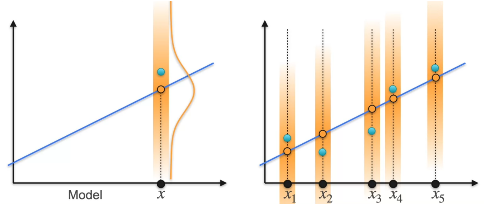
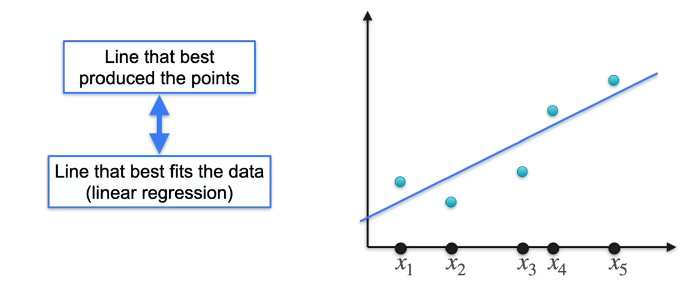

Maximum Likelihood Estimation (MLE) is a statistical method used to find the best-fit parameters for a data model by maximizing a likelihood function, making the observed data most probable.

In Machine Learning, MLE is used to find the model, given the data

## MLE : Bernoulli

If we toss a coin 10 times and get 8 head, 2 tails which coins would have most likely caused it? Or if we wanted 8 head and 2 tails which coin to choose

From the given options coin 1 is most likely to produce the desired outcome of 8 heads and 2 tails but is there a better option?

In general,

## MLE : Gaussian

If we take two sample points from a distribution, which distribution most likely produced those points?

Here the most likely candidate is $\mathcal{N}\sim(2,1^2)$.  
Now for same points we take new candidates

Here most likely candidate is the one whose mean match with mean of sample points taken (-1,1).
Hence in general, 

Now we generate new candidate keeping the same mean but differing variances

Here most likely candidate is the one whose variance match with variance of sample points taken (-1,1).
Hence in general, 

In normal distribution, the most likely candidate is the one whose mean and variance is closest to mean and variance of the sample data.
## MLE : Linear Regression

MLE tries to estimate for the given data points which line most likely produced the points

### How does lines produce points ?

we think of a line given by the eq 

$$
	y=mx+c
$$

All yellow points lie exactly of the line hence they follow the linear equation but the actual datapoints does not lie on the line, it is either slightly above or below i.e., they have some noise associated with it 

$$
	y_{i}=mx_{i}+b+\varepsilon_{i}
$$

We assume that noise $\varepsilon$ follow a normal distribution around a mean point, the mean point being the point that lie exactly on the line (yellow points).  
We can calculate the error by simply doing

$$
	d_{i}=y-y_{i}
$$

Now we plot the all $d_{i}$ in a separate normal distribution with mean 0 and variance 1

Since it is normal distribution we can get the probability density at any point by

$$
	f(x)=\frac{1}{\sqrt{ 2\pi }}e^{-\frac{1}{2}d^2}
$$

Here
- If the points lie exactly on the linear equation line then d is 0 giving $\frac{1}{\sqrt{ 2\pi }}$ which is the maximum height.
- If the point does not lie on linear equation line, the farther the point is from the line, higher the value of d is, which means in normal distribution it is further from mean (towards tail of bell curve), giving small and small value of $f(x)$.
- For larger value of $f(x)$ (smaller value of d) it means the point most likely came from the line and for smaller value of $f(x)$ (larger value of d) it means points is most likely not from the line.

Here to find the best possible line that most likely produced the datapoints, the MLE must be maximum, to calculate the MLE we simply multiply probability density of all $d$.
- We remove the constants as it does affect our goal.
- Next we put log to remove the e. Now we have

$$
	-(d_{1}^2+d_{2}^2+d_{3}^2+d_{4}^2+d_{5}^2)
$$

- Because the exponent has a negative sign, to maximize our MLE we must minimize the exponent, i.e., minimize the above summation
- But the above summation is simply the Least Square Error which we solve in Linear regression.

Hence,
- Linear Regression : Try to find the line that best fit the datapoints by minimizing the loss.
- MLE : Try to find the line that most likely produced the datapoints.
MLE is a **general statistical method for estimating parameters**, while linear regression is a **specific modeling problem**.  

MLE can be used for many models:
- Linear regression → Gaussian likelihood
- Logistic regression → Bernoulli likelihood
- Poisson regression → Poisson likelihood
- Normal distribution → estimate mean/variance
- Many neural-network models → likelihood-based objectives