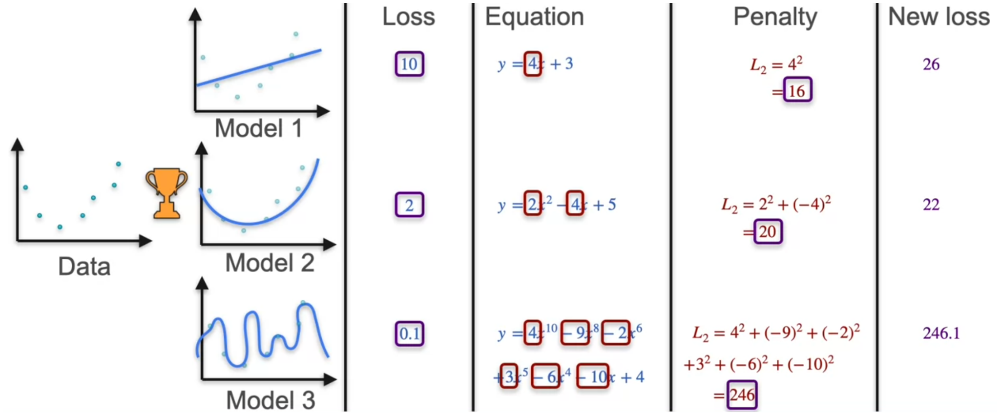

Regularization is a technique used in machine learning and statistics to prevent models from overfitting. It adds a penalty for complexity to the model. This forces the algorithm to learn simpler, more general patterns instead of memorizing noise in the training data.

In above figure Model 3 best fits the the datapoints but the model is way too complex. Even though model 3 passes through all datapoints when we try to use model 3 to predict results the model gets easily confused on which way to move, when build model we are not just trying to find a line that fit all points instead we are trying to understand the trend of how datapoints are moving.  
Even though model 3 fits the best it is not the best model as it is overfitting, to find the best model we regularize it

Now we can see that model 2 is actually the best for the given datapoints.

L2 Regularization is done with :

