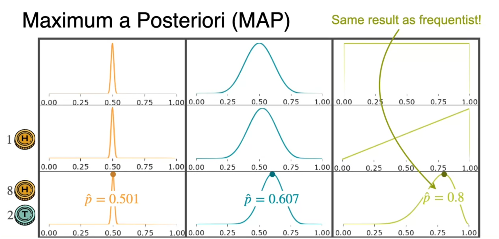

Initially in MLE we saw a case where popcorn was lying in front of the couch and we try to guess which event likely caused this to happen

We came to conclusion that most like watching movies caused it to happen. Now if we introduce a new event of having a popcorn throwing contest

Initially simply looking at the case we might think that popcorn throwing contest most likely caused the popcorn to be in front of the couch. But it is highly unlikely that popcorn throwing contest every happened as it is not very common thing to happen when we take that into account the inequality changes

here even though popcorn throwing contest most likely caused the event but the probability of popcorn throwing contest actually happening is so low that when we see overall, the event most likely happened due to watching movies.  
Important idea here is our prior belief of popcorn throwing contest causing the event has changed after further investigation to watching movie caused the event.
## Frequentist VS Bayesian

Frequentist and Bayesian statistics are two core philosophical approaches to data analysis and probability. The main difference is how they define probability: Frequentists view probability as a long-run frequency of repeatable events with fixed parameters, while Bayesians treat probability as a degree of belief that updates with new data.

Lets say a fair coin is tossed 10 times, and asked in the next toss what is the probability of head ?
- A Frequentist simply looks at the data and calculate the probability and assumes the probability of head in next toss is 0.8
- A Bayesian has a prior belief that because the coin is fair it has a probability of 0.5. But looking at how many times the head came in 10 toss, the bayesian is willing to update her prior belief to a probability favoring heads (posterior) of 0.52.
Hence,

## Maximum A Posteriori estimation (MAP)

It is basically the parameter value that is most probable after seeing the data.

Lets say there are 3 Bayesian and we toss a coin :
- Bayesian 1 : Belief the coin is very fair and has prior belief of probability = 0.5.
- Bayesian 2 : Belief the coin is fair but is willing to deviate a little, has prior probability = 0.5 with same deviate
- Bayesian 3 (non-informative prior) : Has no prior assumption so assigns same probability to all values.
After doing coin toss few times, the final probability achieved is called MAP.  
For non-informative prior it is basically same as frequentist.
## Updating Prior

To update the prior belief to posterior we use the bayes theorem which we already dealt with before.

Let assume we have two types of coin :
- fair coin where $P(H)=0.5$.
- unfair coin where $P(H)=0.8$.
Now we have mystery coin and we have to guess if the mystery coin is fair or unfair. We take a random initial assumption (prior belief) that the mystery coin has :
- probability of being fair, $P(Y=0.5)=0.75$.
- probability of being unfair, $P(Y=0.8)=0.25$.
Now we toss the coin once and notice it landed on head. Using Bayes theorem we calculate probability of mystery coin being fair or unfair given that the coin landed on head. 

After calculation we see that our initial belief is updated.
- The probability that mystery coin is fair has decreased by a small amount and the probability of mystery coin being unfair increased by a small amount.
- The probability still landed on mystery coin being fair because initial we took an unfair division i.e., $P(Y=0.5)=0.75$ and $P(Y=0.8)=0.25$, but after looking at the result from one flip it tried to correct itself by showing the posterior values.
- If initial we took even chances $P(Y=0.5)=0.5$ and $P(Y=0.8)=0.5$, then posterior result will have higher value for $P(Y=0.8|X=1)$ and intuitively it makes sense too as the unfair coin has higher probability of landing head and our mystery coin also landed head it is natural to assume it is unfair.

In general for probability distribution based on random variable being discrete or continuous, our equation can be written as :

$$
\begin{gathered}
P(Y=y\mid X=x) \\[6pt]
\text{This can be interpreted as,} \\[4pt]
\text{``What is the probability that }Y=y\text{, when we know that }X=x\text{?''}
\end{gathered}
$$
In Machine Learning the unknowns are parameters which is denoted by 

$$
	\begin{align}
	y&=mx+c \\
	\Theta &=(w,b)
	\end{align}
$$
Hence in Machine Learning the notations become :

