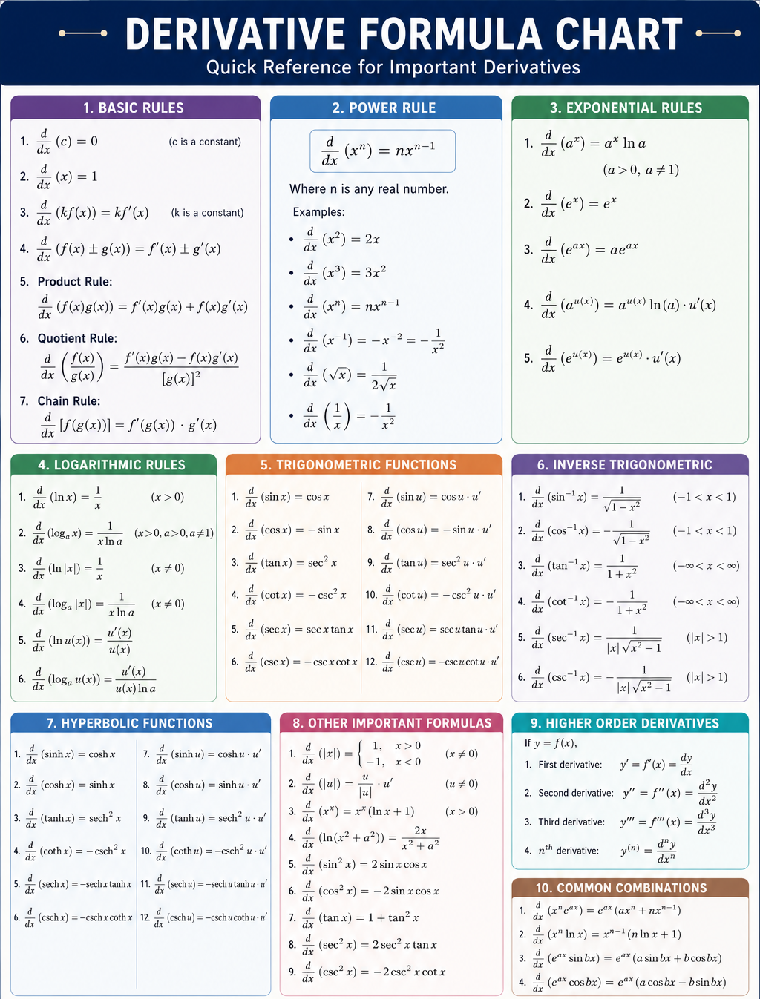
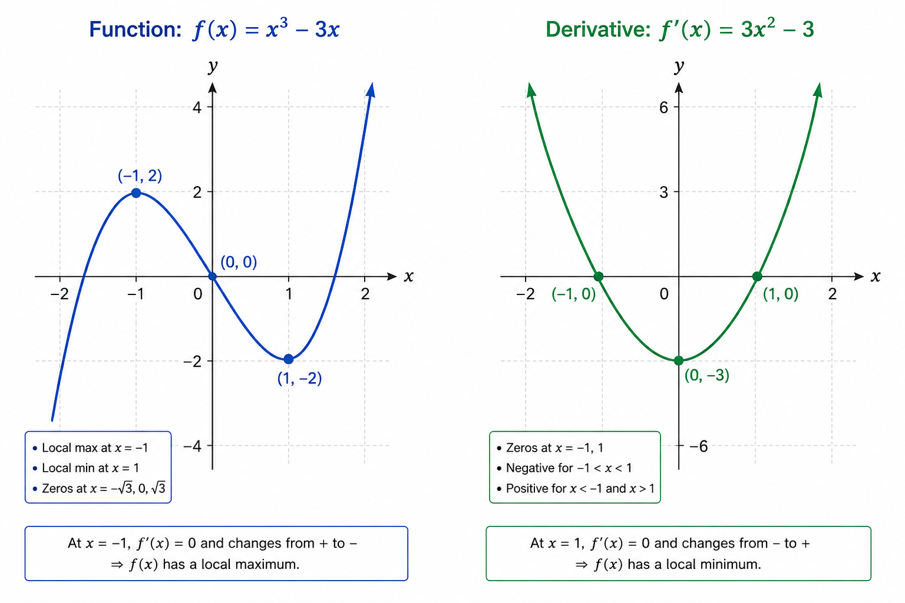

Two notations for derivatives :
$$
	\begin{align}
	\text{Lagrange's Notation,} \\
	f'(x) \\
	 \\
	\text{Leibneiz's Notation,} \\
	\frac{dy}{dx}
	\end{align}
$$
Quick derivative chart

Derivative help us find the slope of a function

This idea of finding slope can be used to find maxima and minima points of a function.

## Loss Function

A **loss function** is a general term for **any mathematical function that measures how wrong a model's predictions are**.  
There are many ways to calculate loss in a model :
1. Square Loss (MSE)
2. Log Loss (cross-entropy)
3. Absolute Loss (MAE)
4. Hinge Loss
5. Huber Loss 
...etc.

### Squared Loss

**Squared loss** is mainly used for **regression** (predicting numbers). 
$$
	MSE = \frac{1}{n}\sum_{i=1}^n(y_{i}-y_{i}')^2
$$
In MSE we calculate the value of actual - predicted and take sum of squares. The reason for squaring is that
- Squaring makes all value positive.
- Large error becomes much larger. For ex. : error of 2 will give loss of $2^2=4$ and error of 10 will give $10^2=100$ which is a very large error.

## Log Loss

