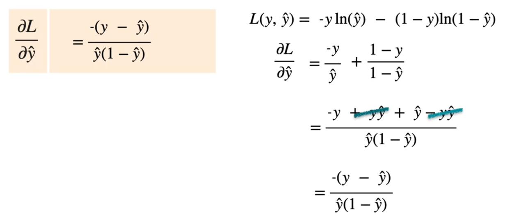

We are going to create a sentiment analysis model for an alien language

Here we have 4 sentences containing words "aack" and "beep". We create a data table counting the number of times each word appearing in moods : "happy" and "sad". Our goal is given a sentence containing the words "aack" and "beep", classify whether alien is happy or sad.  
We plot the amount of times "aack" and "beep" appear in a graph

Here we notice that happy and sad can be separated by drawing a line with eq:
$$
	z=w_{1}x_{1}+w_{2}x_{2}
$$
Here the equation will give an some value but for classification we only have two state. Here after calculating $z$ we pass it through another function called **Activation Function**.  

There are multiple activation function in our case we will be using an activation function called **Sigmoid Function** which is given by
$$
	\sigma(z)=\frac{1}{1+e^{-z}}
$$
which turn any numerical value to 0 or 1.

## Sigmoid Function

The sigmoid function crunches the entire number line in range of 0 and 1.

If value of $z$ is 0 sigmoid function give $\frac{1}{2}$ . But for large positive value it give value 1 and for large negative value it give output 0.

### Derivative of Sigmoid function

$$
\begin{align} 
\sigma(z)&= \frac{1}{1+e^{-z}}\\
&=(1+e^{-z})^{-1} \\
	\frac{\delta \sigma(z)}{\delta z}&=\frac{\delta(1+e^{-z})^{-1}}{\delta z} \\
	&=-1(1+e^{-1})^{-2}.\frac{\delta(1+e^{-z})}{\delta z} \\
	&=-1(1+e^{-1})^{-2}(0+e^{-z})(-1) \\
	&=(1+e^{-1})^{-2}.e^{-z} \\
	&=\frac{e^{-z}}{(1+e^{-1})^2} \\
	&=\frac{e^{-z}+1-1}{(1+e^{-z})^2} \\
	&=\frac{1+e^{-z}-1}{(1+e^{-z})^2} \\
	&=\frac{1+e^{-z}}{(1+e^{-z})^2}-\frac{1}{(1+e^{-z})^2} \\
	&=\frac{1}{(1+e^{-z})}-\frac{1}{(1+e^{-z})^2} \\
	&=\frac{1}{(1+e^{-z})}-\left( \frac{1}{(1+e^{-z})} \right)\left( \frac{1}{(1+e^{-z})} \right) \\
	&=\frac{1}{(1+e^{-z})}\left( 1-\frac{1}{(1+e^{-z})} \right) \\
	& \\
	&\text{we know,} \\
	&\sigma(z)=\frac{1}{(1+e^{-z})} \\
	&\text{So,} \\
	\frac{\delta \sigma(z)}{\delta z}&=\sigma(z)(1-\sigma(z))
\end{align}
$$

## Calculating Loss

Now if we have a sentence "aack beep beep beep" here $x_{1}=1$ and $x_{2}=3$ we take some random weights $w_{1}$ and $w_{2}$ and bias $b$ , compute the result $z$ and pass it through activation function $\sigma(z)$ once we get the result if the prediction is wrong we calculate the loss.  
For classification models one good loss calculation method is **Log Loss**.
$$
	\begin{align}
	\text{Prediction Function, }z&=\sigma(x_{1}w_{1}+x_{2}w_{2}+b) \\
	\text{Log Loss, }L(y,\hat{y})&=-y\ln(\hat{y})-(1-y)\ln(1-\hat{y})
	\end{align}
$$
Here if $y=0$
- If $\hat{y}$ is large function output is large and if $\hat{y}$ is small function output is small. 
If $y=1$
- If $\hat{y}$ is large function output is small and if $\hat{y}$ is small function output is large. 

## Partial Derivative of Loss function for Gradient Descent

Now our goal is to find optimal $w_{1}$ , $w_{2}$ and $b$ by minimizing the loss function(log loss). For that we have to differentiate the loss $L$ w.r.t $\hat{y}$ but $\hat{y}$ is dependent on  $w_{1}$ , $w_{2}$ and $b$ hence we need to partially derive $\hat{y}$ w.r.t $w_{1}$ , $w_{2}$ and $b$.

we know derivative of sigmoid function is 

$$
	\frac{\delta \sigma(z)}{\delta z}=\sigma(z)(1-\sigma(z))
$$
Hence

Now partial derivative of loss w.r.t $w_{1}$ , $w_{2}$ and $b$

which is 

## Updating $w_{1}$ , $w_{2}$ and $b$ using gradient descent

