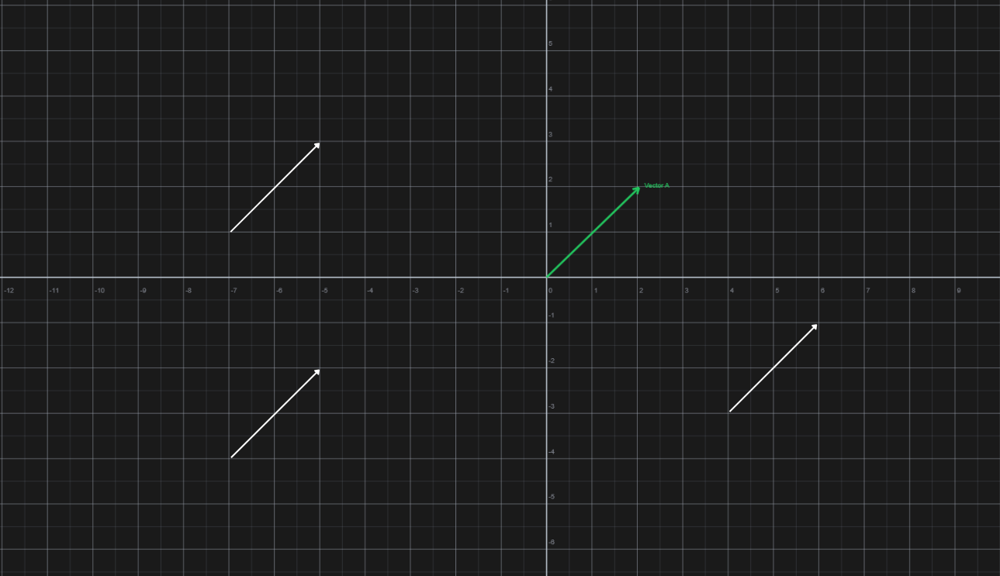
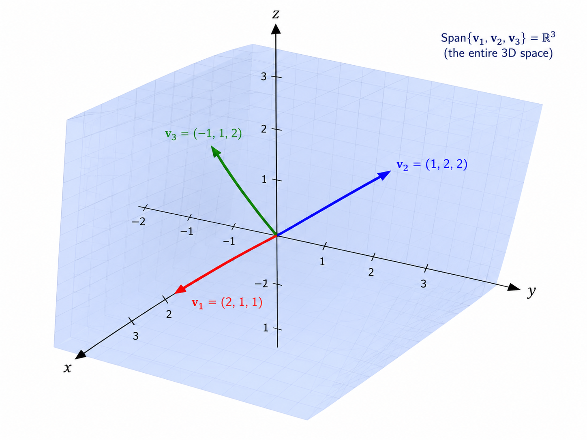
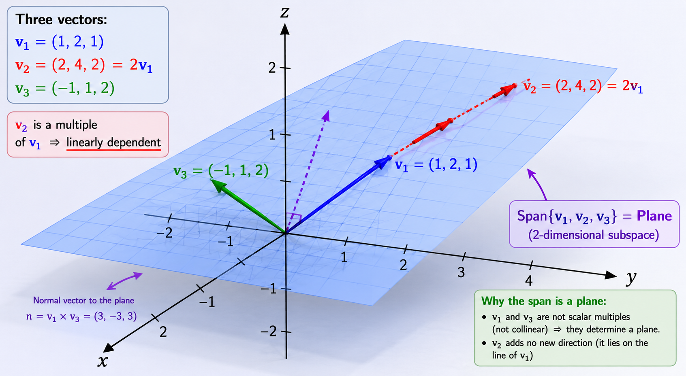
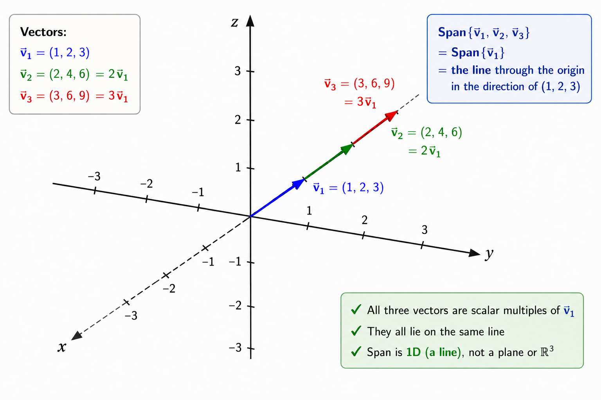

Vector can be understood in three ways :

-  Physics Perspective : Vectors are arrows pointing in space which has two main component magnitude and direction. If both remain the same we can move it around and its the same.
    - Here all are same vector as magnitude and direction remain same

- Computer Science perspective : its simply is a list of number representing some quantity. For ex - [2000, 5] here 2000 could be house rent price and 5 could be rooms, or 2000 could be price of 5 bicycle. here the order matters [2000, 5] ≠ [5, 2000], here we represent house vs price as vector.
- Mathematician Perspective : It basically says vector can be anything as long as we can add or multiple vectors.

In Linear algebra when we talk about vectors almost all the time we imagine tail of vector to be at origin of coordinate plane.

.png)

in 3D

.png)

  

## Vector Addition/Subtraction

To add or subtract two vector we can think of it as

.png)
- when we add two vectors we can think of moving the tail of any one vector to head of other vector and drawing a vector from origin to moved vector’s head.

Why ?
- When we see learn in 1 D i.e, number line 5 + 2 can be said as moving file step to front and again 2 more step then we reach 7 same with first 2 step and then 5 step here too vector addition is simple first moving in any one vector direction and then moving in second vector direction. i.e, resultant of moving in x-axis vector A = 2 and vector B = 2 so in x-axis we move 2 + 2 till position 4 and in y-axis vector A = 3; vector B = -2 so 2 + (-3) = 1 so move 1 position in y-axis. So resultant is 4,1.

## Scalar Multiplication

When we multiply a number to a vector we increase or decrease the vector this is called ***Scaling*** and the number by which we multiply its called ***Scalars***.

.png)

- The resultant vector is simply the the scalar multiplication of individual values of vector.
- 
.png)

## Basis Vectors

***Basis Vectors*** are basically a reference from which we create the vector they are represented by : $\hat{i}$ and $\hat{j}$ (i-hat and j-hat).

We represent all other vector as vector scaling and addition of basis vectors. Here basis vector are unit vectors.

.png)

It necessarily does not has to be unit it can be any value

.png)

Here the basis vector are (1, 1) and (1, -1). Here the vector C is same but as basis vector changed coordinate of Vector C changed but no matter what basis vector we choose we can recreate any vector in different basises its just that coordinate changes.

This act of showing vector as scaling and addition of basis vector is called ***Linear Combination***.

## Span

The ***Span*** of a set of vectors is the set of **all vectors that can be formed using linear combinations** of those vectors.

For a given v and w vector in 2D space there are 3 possible cases :

- If vector v and w are not overlapping and allowed to move freely it can create all possible vector existing in 2D space. So, here the span of vector v and w is all vector existing in the 2D plane.

.png)

- If vector v and w overlap each other and allowed to move freely all vector existing in the line of overlap can be created by v and w. So, here the span of vector v and w is all vector which exist in line overlapping the vectors.

.png)

- If both vector are 0 only possible vector is origin. So, here span of vector v and w is just the origin.

.png)
## Independent & Dependent vectors

In the previous 2D space we can have as many vectors as possible but we can recreate any vector with the 2 available vector hence more vectors are redundant. 
- If a vector exist in a span of other vector such vector are called ***Linearly Dependent Vectors***.
- If a vector does not exist or cannot be reproduced by other vector such vector are called ***Linearly Independent Vectors***. 
From previous diagram in :
- First diagram $\vec{v}$ and $\vec{w}$ are Linearly Independent Vectors and all others are Linearly Dependent Vectors. Or we can take any two vector that does not overlap they are Linearly Independent and from their perspective all other are Linearly dependent.
- Second diagram $\vec{v}$ and $\vec{w}$ are Linearly Dependent. 
- Third diagram too $\vec{v}$ and $\vec{w}$ are Linearly Dependent.

In 3D space with 3 vectors, we have 4 cases :

- If we have 3 Linearly Independent vectors the span is the whole 3D space as the Linear Combination of these 3 vector can create any vector existing in 3D space. 

-  If out of 3 vectors, 2 vectors are Linearly Dependent. The vectors does not necessarily have to be overlapping if any 1 vector exist in span of other 2 then it is Linearly Dependent. In this case span is a Plane 

- If all 3 vectors are Linearly Dependent then the span is a Line.

## Important

- In 2D maximum number of possible Linearly Independent vectors is 2.
- In 3D maximum number of possible Linearly Independent vectors is 3.