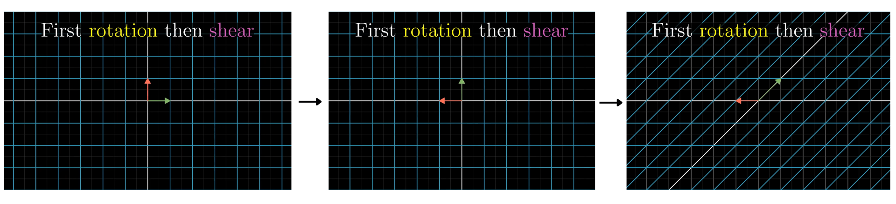
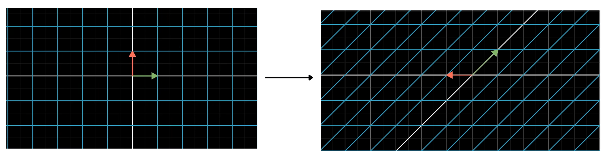
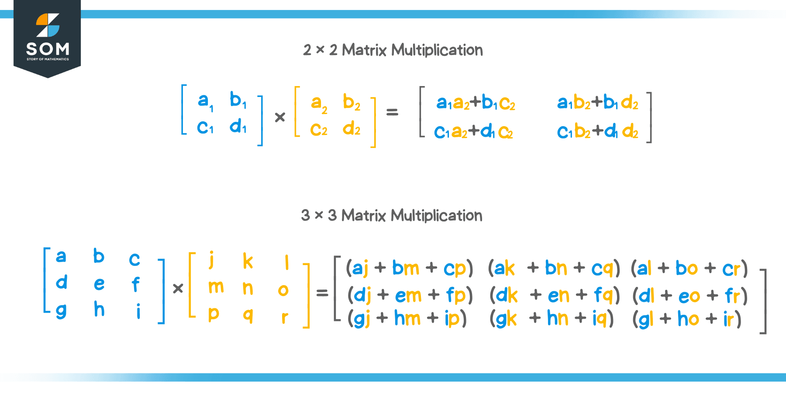

When we multiply 2 or more matrix we are basically doing Linear transformation multiple times one after another

We can achieve the same result by doing just one transformation

## Linear Composition

In linear algebra, the ***composition of linear transformations*** is the process of applying one linear function to a vector, and then applying a second linear transformation to the resulting vector.

Matrix multiplication gives a single matrix representing the cumulative/resultant transformation of multiple linear transformations. This is called ***Linear Composition***.

In our previous image, first we do rotation, so transformation is $\begin{bmatrix}0&-1\\1&0\end{bmatrix}$ then we do shearing $\begin{bmatrix}1&1\\0&1\end{bmatrix}$ , the overall transformation can be achieve simply by doing a transformation of $\begin{bmatrix}1&-1\\1&0\end{bmatrix}$ 

.png)

.png)

>[! Important]
>We cannot interchange the transformation and expect same result i.e,
>first rotation then shear $\neq$ first shear then rotation as
>$f(g(x))\neq g(f(x))$

## How to find the composition matrix ?

To find the composition matrix we have to remember what matrix multiplication really is i.e, one transformation after another. 

.png)

Here, we know if a vector was there first M1 matrix transformation will occur. Hence M1 matrix has the position of $\hat{i}$ and $\hat{j}$ after the transformation then when M2 matrix transformation occur we can treat current $\hat{i}$ and $\hat{j}$ as vectors whose basis vectors will land on M2 matrix so first we resolve for current $\hat{i}$ .
Now we resolve for current $\hat{j}$ :

.png)

Hence the Final composition matrix is  :
$$
	\begin{bmatrix}
	2&0\\1&-2
	\end{bmatrix}
$$
>[! Important]
>In general we can find composition matrix with
>

>
>When we multiply matrix with matrix or matrix with vector 
>ex : M1 X M2 the no. of cols in M1 must be equal to no. of rows in M2. Similarly when we do M X $\vec{v}$ no. of cols in M must be equal to no. of rows in col/vector must be of size = no. of cols of M.
 
