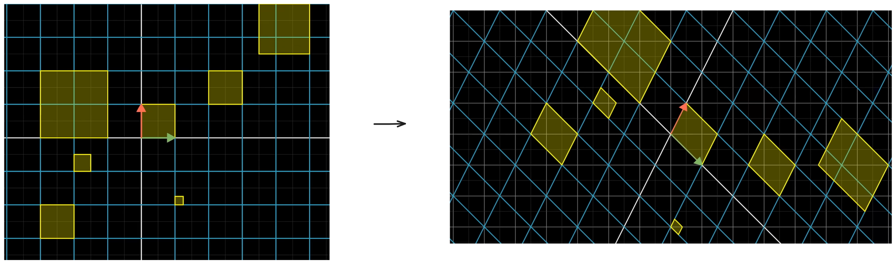
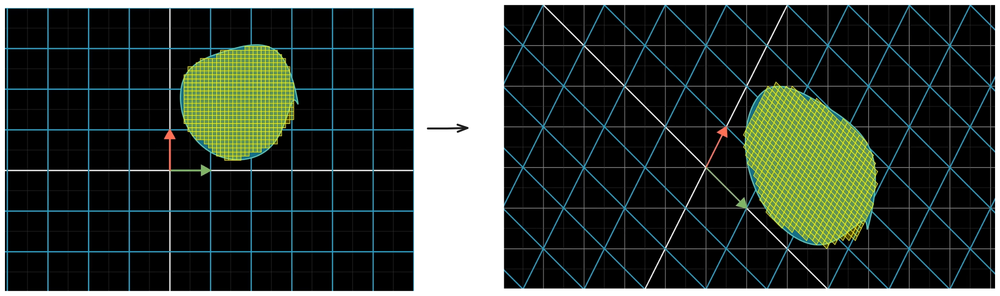
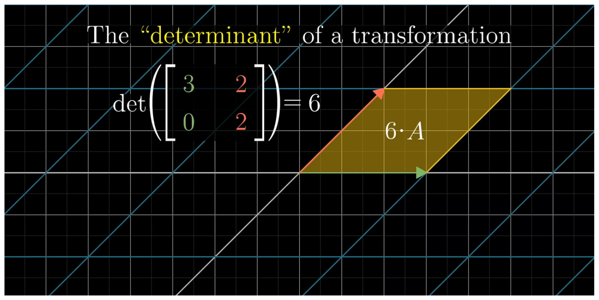
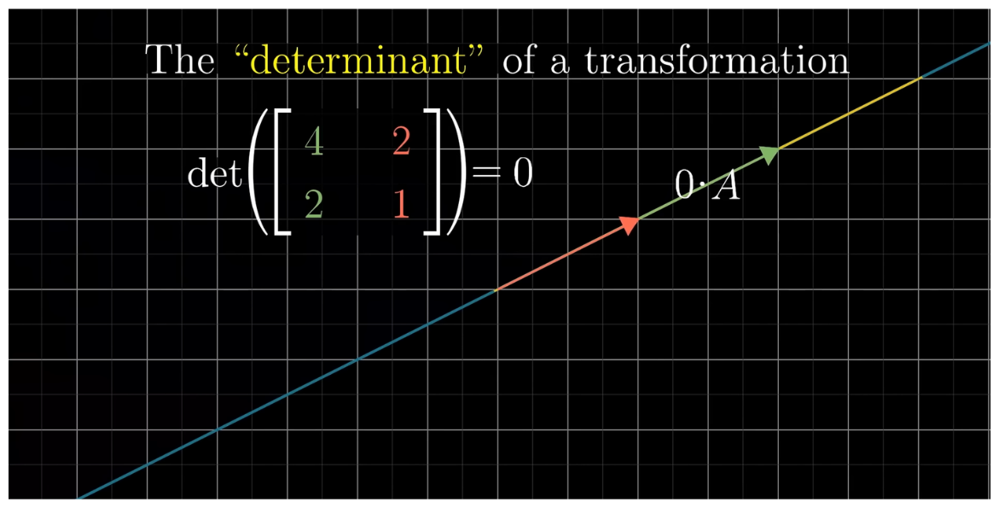
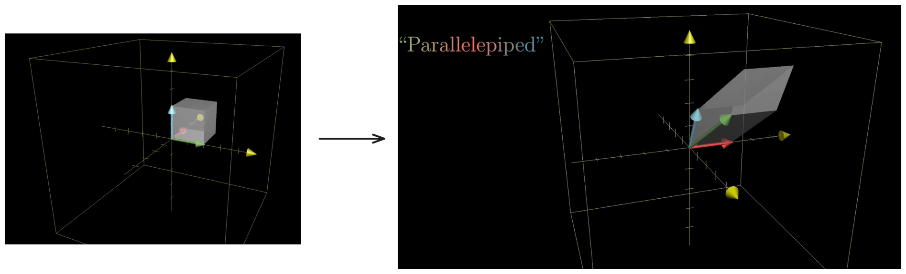
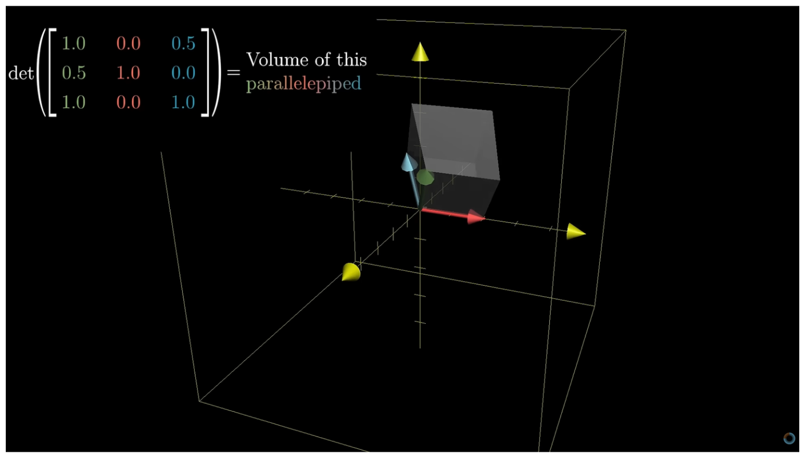
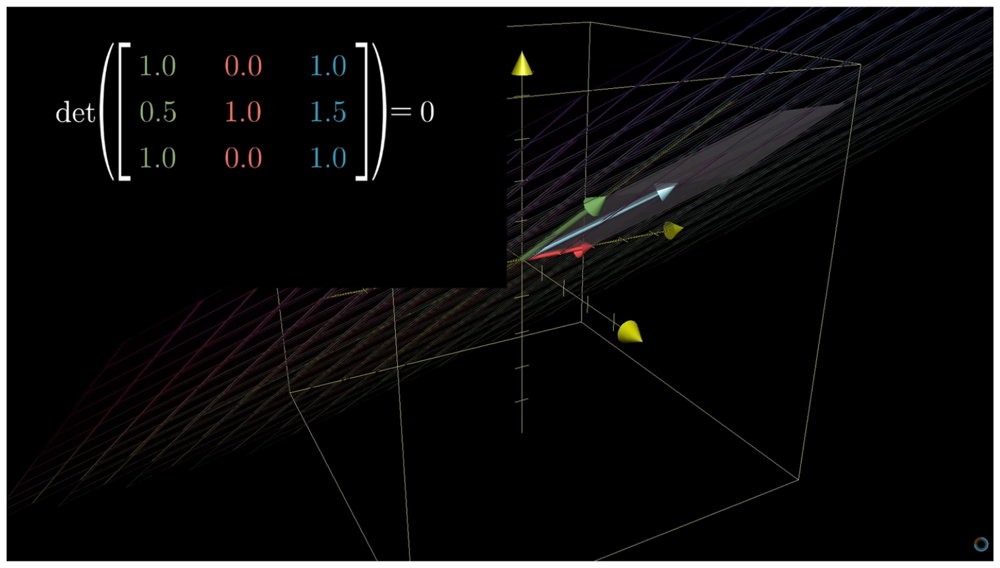
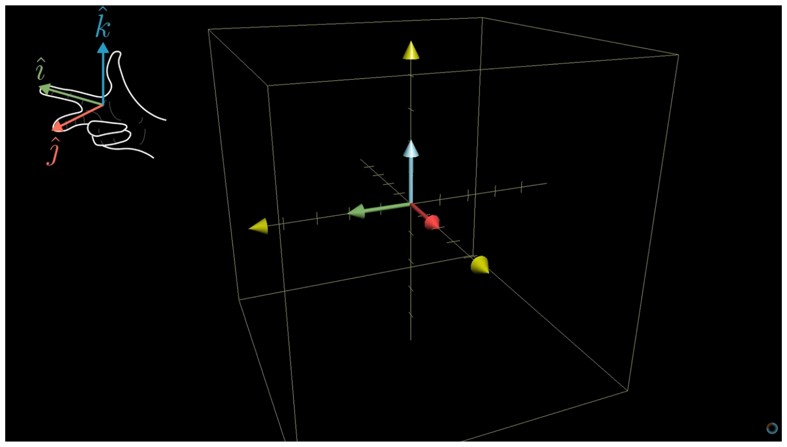
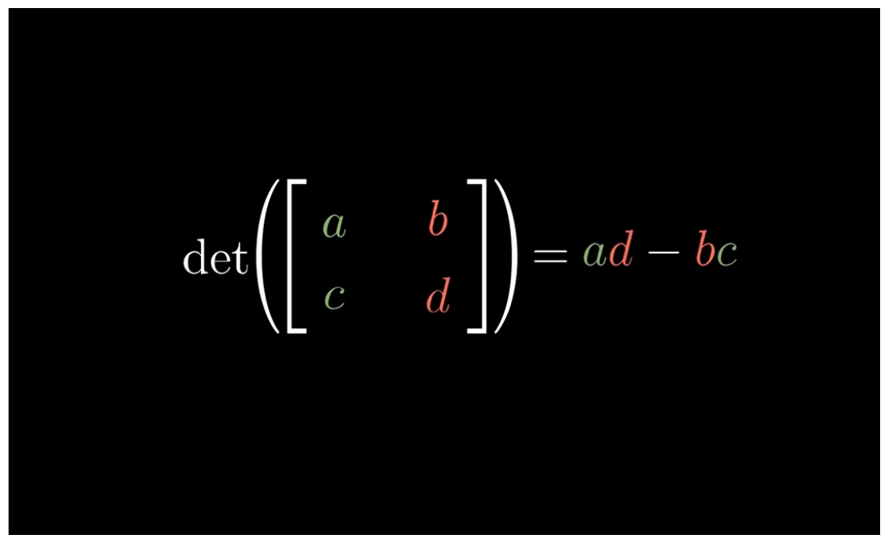
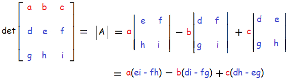

When we do Linear transformations some transformations stretches the space out where some transformations squishes the area. But by how much / by what factor ? Determinants helps us in answering that.

Lets understand by example :

Here in first case the area has increased after transformation by 6 factor where in second case no change in area after transformations. Hence it is not necessary that transformations cause area to stretch or shrink.

>[!Note]
>When linear transformation occur the factor by which area increase it is not just for area under $\hat{i}$ and m$\hat{j}$ , its all possible area we can think of increases by same factor. As in linear transformations the grid lines remain parallel and evenly spaced.

>Even for uneven non-rectangular spaces like

This factor by which a linear transformations change any area it is called ***Determinants***.

## Negative Determinants

When we say determinants is the factor by which an area increases or decreases after transformations. Negative value should not be possible as increased or decreased by negative value does not make sense.
In determinants, negative values are possible here negative value represent inversion of orientation after linear transformations.

The absolute value still represent the factor by how much it has increased or decreased, and the symbol represent whether it has been inversed or not.

Idea : If we keep any one of the basis vector as stationary and slowing  move the other basis vector towards it the area squishes slowing at one point when both basis vector line up , area is 0 and if we still keep moving its ideal to make it negative.

## 3D

In 3D, when we talk about determinants we are talking about increase or decrease in volume by a factor.

If the basis vector are linearly dependent then it form a Plane, Line or a Point in all case determinant will be 0.

For negative determinants to know understand when inversion occur simple rule is :
- In our right hand can align our thumb to $\hat{k}$ , our index to $\hat{j}$ and our middle finger to $\hat{i}$ . Then no inversion occurred.
- If not inversion occurred during transformations.

## How to find determinants without visualizing ?

In 2D,

In 3D,

>[! Note]
>
>$$
>	\det(M_{1}M_{2})
>	= 
>	\det(M_{1})\det(M_{2})
>$$
>If the matrix $M_{1}$ scales any area "A" to "cA", and $M_{2}$ scales any area "A" to "dA", so this means that $\det(M_{1})=c$ and $\det(M_{2})=d$, which implies $\det(M_{1})\det(M_{2})=cd$. Now, if we consider the matrix $M_{1}M_{2}$, it is essentially like scaling the area "A" first by matrix $M_{2}$, and then by matrix $M_{1}$. So, when we first transform "A" with $M_{2}$, the area becomes "dA". Then, when we transform this new area "dA" with matrix $M_{1}$, we know that $M_{1}$ scales any area by a factor "c", so the new area becomes "cdA", hence we can conclude $\det(M_{1}M_{2})=cd$. This shows that $\det(M_{1}M_{2})=\det(M_{1})\det(M_{2})$.

