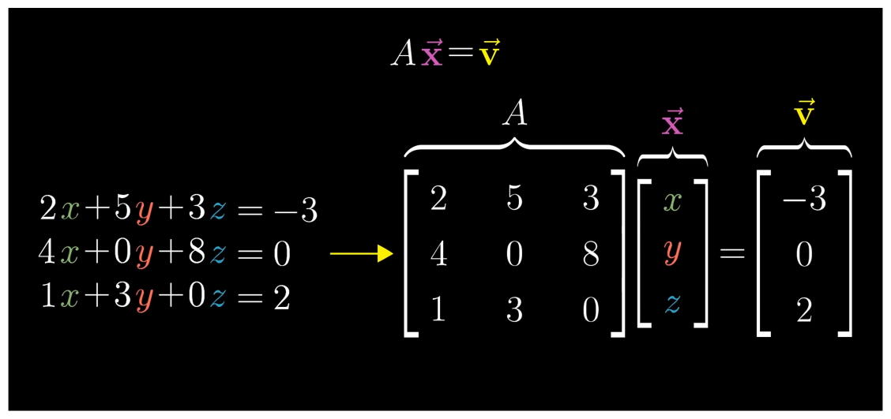
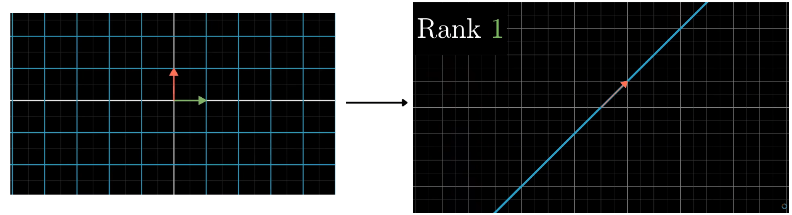
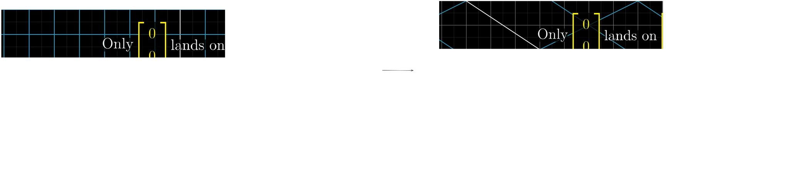

In Linear algebra, we learn how to solve simple equations like $y=5+x$ or linear equation in two variable $y=3x+5,y=x+3$ we can use several methods to solve this but if we carefully see a system of linear equations
$$
\begin{aligned}
2x + 5y + 3z &= -3\\
4x + 0y + 8z &= 0\\
1x + 3y + 0z &= 2
\end{aligned}
$$ Here if we notice it look similar to vector matrix multiplication. Hence we can represent the same equation in matrix format

Here vector $\vec{x}$ after transformation with matrix $A$ becomes vector $\vec{v}$ . Hence if we can we reverse the transformation we should be able to find the vector value of $\vec{x}$ .

### Solving

Before solving the equation we first need to know whether it is solvable or not i.e, if after transformation span is unchanged that means for a vector $\vec{v}$ one unique vector $\vec{x}$ must exist. But if span squished to lower dimension like 2D -> line or point , 3D -> plane, line or point, all the vectors before transformation comes to a line or plane(3D) so reversing the matrix result in either infinitely many vector solutions or no solution.

We know how to find if span is getting reduced to lower dimension i.e, ***the determinant***.

>[! Note]
>If the $\det(M) = 0$ then equation is not solvable it can have infinitely many solution or no solution. Hence all solvable equation must have $\det(M)\neq0$
>

When we solve the equation do linear transformation on vector $\vec{v}$ with a matrix $A^{-1}$ which reverses the transformation effect of matrix $A$. This matrix $A^{-1}$ is called ***Inverse Matrix***.
Hence matrix multiplication of $A^{-1}A$ does nothing.
$$
	A^{-1}A = \begin{bmatrix}
	1&0 \\
	0&1
	\end{bmatrix}
$$
this Matrix that does nothing is called ***Identity matrix***.
Hence,
$$
\begin{aligned}
A \vec{x} &= \vec{v}\\
A^{-1}A \vec{x} &=  A^{-1}\vec{v}\\
\vec{x} &= A^{-1}\vec{v}
\end{aligned}
$$
## Rank

The number of dimensions in the output of transformation.
### Rank 1
When the output of a transformation is a line i.e, 1 dimensional, or if a transformation results all vector squishing to a line, then such transformation is called Rank 1 transformation.

### Rank 2
If the transformation result in all vector landing in a plane such transformation is called Rank 2 transformation.

for 2D, before transformation all vector are already in 2D plane. Hence, if a matrix does not squish it to line or point, all transformation by default is Rank 2 transformation. 

### Rank 3
If after transformation all vector land in 3D space i.e, span is 3D it is called Rank 3 transformation. For 3D as before transformation already all vector live in 3D space if the transformation does not cause it to squish to lower dimension, by default all transformations are Rank 3 for 3D. For 2D we cannot do Rank 3 transformations as by default 2D lacks a basis vector $\hat{z}$ . 
## Column Space

The set of all possible vector outcomes after transformation is called column space.
For 3D all possible vector after transformation can be in 3D space , a plane or a line.
For 2D all possible vector after transformation can be plane or a line. A vector existing in 2D cannot be transformed to 3D space. As a 2D matrix lacks one extra column or one extra basis column $\hat{z}$ .

When the rank is as high as it can be i.e, for 3D Rank 3 and for 2D Rank 2 , then the matrix is called ***Full rank***.

## Null Space / kernel

For full rank transformation the only vector that lands on origin is the zero vector itself i.e, $\vec{v}=\begin{bmatrix}0\\0\end{bmatrix}$ . As in linear transformation origin must remain in same position.

But if linear transformation is not a full rank and transformation result in squishing to lower dimension there is a full line of vectors that get squished to origin.

Even in 3D if its not full rank and result in dimension squishing to a plane. There is a whole line of vector that get squished to origin.

If the 3D space get squished into a line there is a whole plane full of vectors that squishes to origin.

This set of vector which land on origin after squishing dimension during transformation is called ***null space or the kernel of our matrix***.