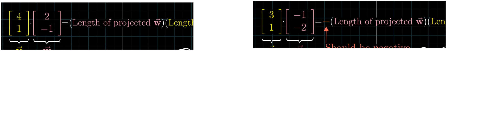
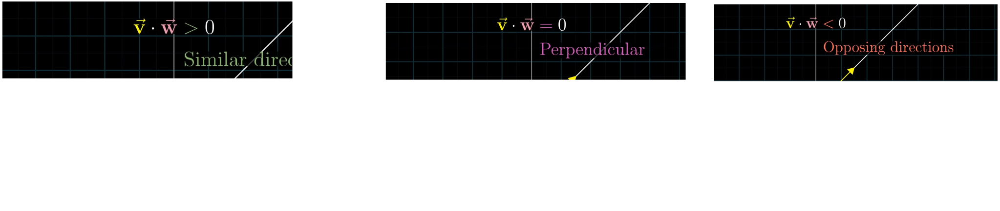
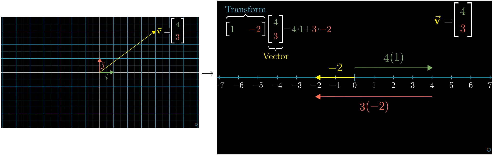

The dot product between two vectors can be done simply by multiplying its the respective axis coordinate and summing it up. For ex:
$$
	\begin{bmatrix}
	3\\2
	\end{bmatrix} +
	\begin{bmatrix}
	4\\5
	\end{bmatrix}=
	3*4 + 2*5
$$
## Geometric Representation

When we do dot product between vectors $\vec{v}$ and $\vec{w}$ its basically either projecting vector $\vec{v}$ on $\vec{w}$ then multiplying the projection length and length of vector on which it was projected or vice-versa.

>[! Note]
>When we do dot product between two vectors there are 3 possible cases :
>
>cases :
>	- when both vector are facing same direction dot product is positive.
>	- when both vector are perpendicular to each other dot product is 0.
>	- when both vector are facing opposite to each other dot product is negative.

## How is matching coordinates, multiplying pairs and adding together have any relation to projection?

If we do a linear transformation such that it turns 2D vector space to 1D i.e, line. If we have evenly spaced point the points remain evenly spaced after transformation.

We already know a linear transformation is represented by matrix hence here too if we write a matrix with column as coordinates of $\hat{i}$ and $\hat{j}$ . It gives us a 1 X 2 matrix 

Now if we have a vector and it does a transformation from 2D to 1D we already know the linear combination remain same even after transformation. Hence,

## Duality

Here in previous diagram the linear combination of $1*2$ matrix and the column vector look exactly similar to doing a dot product between two vectors , its just matrix is tilted horizontally
$$  
\begin{array}{c}  
\vec{w} = \begin{bmatrix}1\\-2\end{bmatrix} \\[1em]  
\vec{v} = \begin{bmatrix}4\\3\end{bmatrix} \\[1em]  
\text{here if we do dot product of the two vectors we get} \\[1em]  
\vec{w}\cdot\vec{v}  
=  
\begin{bmatrix}1\\-2\end{bmatrix}  
\cdot  
\begin{bmatrix}4\\3\end{bmatrix} = 1 \cdot 4 + (-2) \cdot 3\\  
\end{array}  
$$
Now with matrix
$$
	\begin{array}{c}
	M = \begin{bmatrix}
	1 & -2
	\end{bmatrix} \\
	\vec{v} = \begin{bmatrix}
	4\\3
	\end{bmatrix} \\
	\text{here if we do linear transformation on vector} \\
	M.\vec{v} = \begin{bmatrix}
	1 & -2
	\end{bmatrix} 
	.\begin{bmatrix}
	4\\3
	\end{bmatrix}=1\cdot4 + (-2)\cdot 3
	\end{array}
$$
which gives exact same result but here one is matrix and other is vector and they are completely different objects. As
This is exactly where **duality** starts to appear.
- The **column vector** $\vec{w}$ is an arrow in space.
- The **row vector** (matrix $M$) is a linear function that takes vectors and returns numbers.
In general linear algebra, vectors and linear functions are different kinds of objects. The space of linear functions is called the **dual space**.
A common way to say it is:
- A column vector is a vector.
- A row vector is a dual vector (a linear functional).

## Uses of dot Product

The dot product measures **how much two vectors point in the same direction**.

here if we know $\vec{v}$ and $\vec{w}$ we can find the value of $\theta$ . Hence we can find the how far apart are the vector from each other.