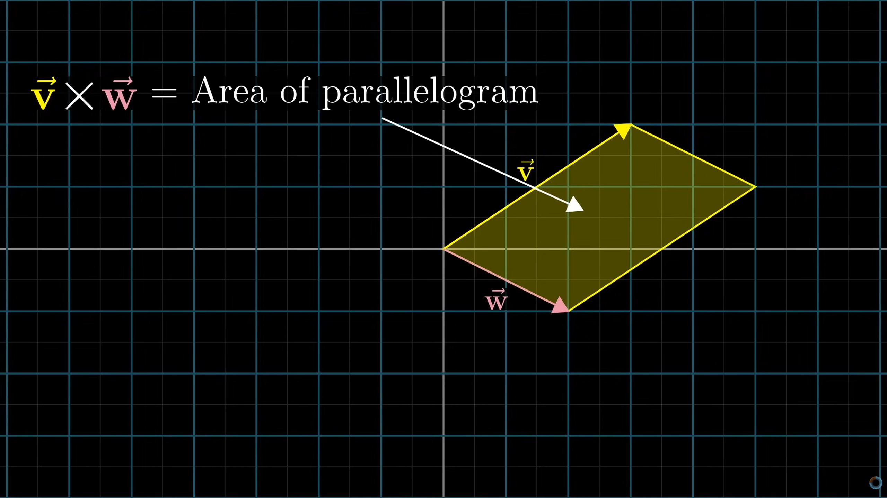
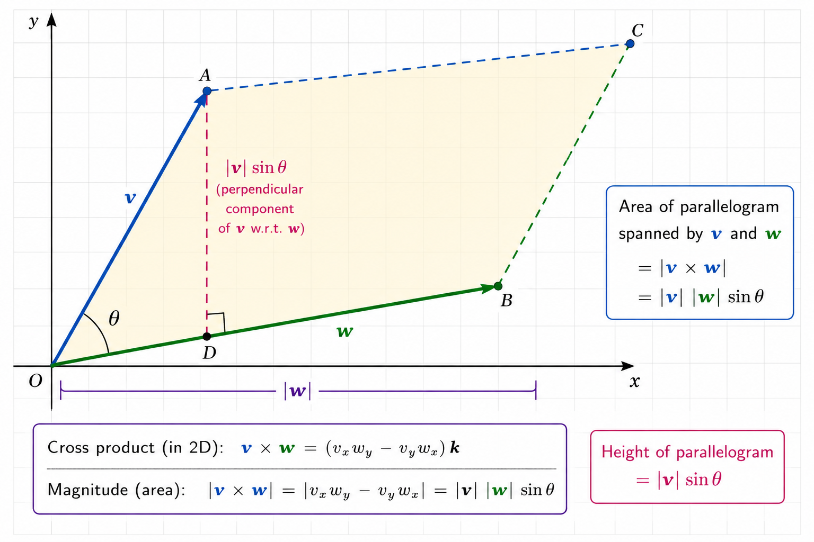
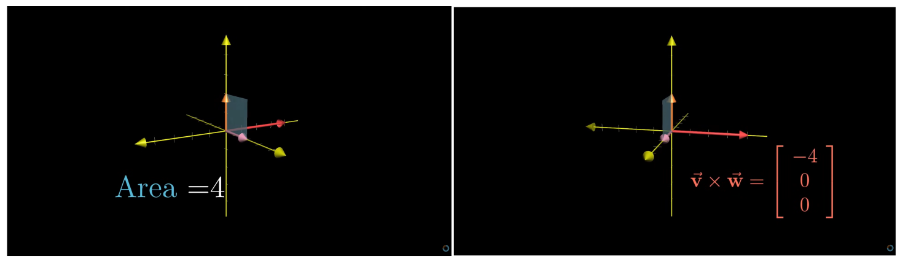
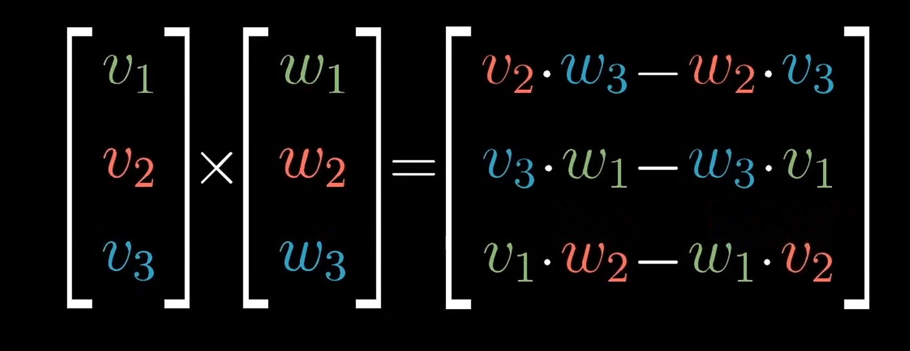
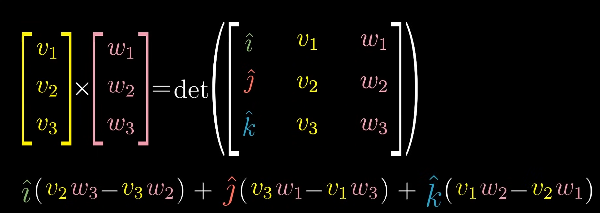

Cross product between two vectors gives us the area enclosed by the parallelogram created by the two vectors.

Here the orientation matter

if we do $\vec{v}X\vec{w}$ and v is on left side of w area is negative but if w is on right side area is positive

.png)

we already know that determinant shows the area enclosed inside matrix and we also know area of parallelogram is $bXh$ (breadth X height). Hence

.png)

Here we treated the vector as matrix and find area also 

we know height of this parallelogram is $\vec{v}\sin\theta$ so we can easily find the cross product or we can find the value of $\theta$ .

## Real Cross Product

The real cross product is actually not the area in reality cross product between two vector actually gives another vector the magnitude of area in above is actually the magnitude of the new vector.
$$
	\vec{v} X \vec{w} = \vec{p}
$$
This new vector $\vec{p}$ is perpendicular to the parallelogram formed. But which direction?

.png)

We can find that by right hand thumb rule.

>[!important] 
>To find the perpendicular vector of cross product between two vector we can use formula :
>
>

