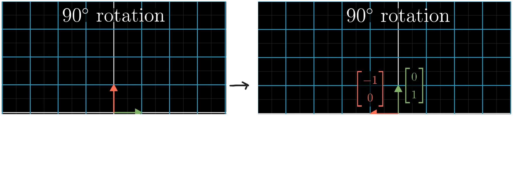
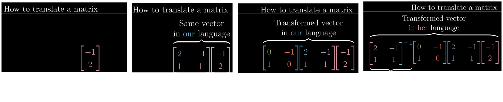

## Basis and Coordinate System

We already know what basis vectors are by now. we also know all vectors are represented by referencing the basis vectors i.e., all vector are scalar multiplication and addition of basis vectors. Up until now we only dealt with basis vector $\hat{i}=\begin{bmatrix}1\\0\end{bmatrix}$ and $\hat{j}=\begin{bmatrix}0\\1\end{bmatrix}$ but we know we change the basis vectors as we like.
The plane on which we represent points or vectors with reference to the basis vectors is called ***coordinate plane***. And the system we follow to give that value is called ***coordinate system***. It is dependent on the basis vectors we choose.

Here we can see the same vector but in two different coordinate system with different basis vectors.

Here we have two basis vector from our standard coordinate system the basis vectors are in coordinate $\vec{b_{1}}=\begin{bmatrix}2\\1\end{bmatrix}$ and $\vec{b_{2}}=\begin{bmatrix}-1\\1\end{bmatrix}$ and our basis vectors are $\vec{i}=\begin{bmatrix}1\\0\end{bmatrix}$ and $\vec{j}=\begin{bmatrix}0\\1\end{bmatrix}$ but in other person's perspective in their coordinate system our basis vector $\vec{i}$ and $\vec{j}$ are in some other coordinate and their basis vectors $\vec{b_{1}}$ and $\vec{b_{2}}$ are unit vector. So basically its two different worlds with different measurement system or different languages. For the same vector with our basis vectors its described differently than theirs.
The only thing that is same is the origin position its just that basis vectors points in different directions.

## How to translate vectors between coordinate systems ?

We will refer the other plane as John's coordinate system.
Here in John's coordinate system a vector exist which in his perspective is at $\begin{bmatrix}-1\\2\end{bmatrix}$ . when we come to our world we notice that John's basis vectors in our coordinate system is at coordinate $\vec{b_{1}}=\begin{bmatrix}2\\1\end{bmatrix}$ and $\vec{b_{2}}=\begin{bmatrix}-1\\1\end{bmatrix}$ we already know Linear combination does not change hence we can multiply and add to get the coordinate of vector in our coordinate system i.e., $\begin{bmatrix}-4\\1\end{bmatrix}$ .

We can this moving from one world to another basically as linear transformation :

.png)

Hence we can represent the coordinate of John's basis vectors in our coordinate system to be as matrix.
If a vector is in out coordinate and if we want to see its coordinate in John's world we simply take inverse matrix of John's basis vectors in our coordinate system.

## How to translate transformations between coordinate systems ?

When we do a linear transformation lets say:

Here for a transformation such as this we write a matrix $M=\begin{bmatrix}0&-1\\1&0\end{bmatrix}$ but here the values of matrix are dependent on the basis vector we choose. But the same transformation in Jennifer's perspective (other basis vectors) will be  

Here the coordinate of matrix will be completely different 
Q. If a vector exist in Jennifer's world and do $90^\circ$ transformation what will be the new vector coordinate.

We can solve this by our knowledge of linear composition 
- Step 1 : First we bring the vector in our coordinate plane.
- Step 2 : Do a $90^\circ$ transformation in our coordinate system.
- Step 3 : Inverse the matrix which brought the vector to out coordinate system so it goes back it original coordinate system i.e., Jennifer's.

Hence when we do $A^{-1}MA$ we are basically doing a linear transformation in other coordinate system.