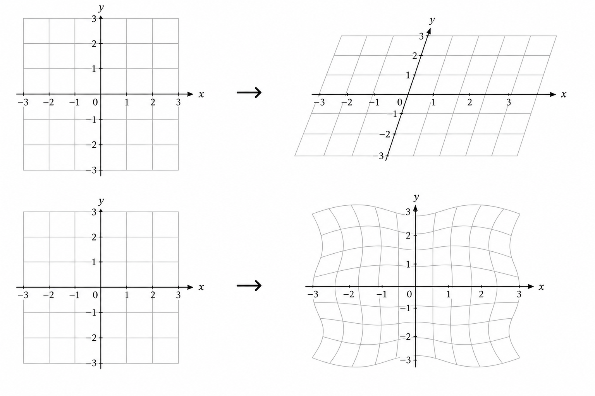
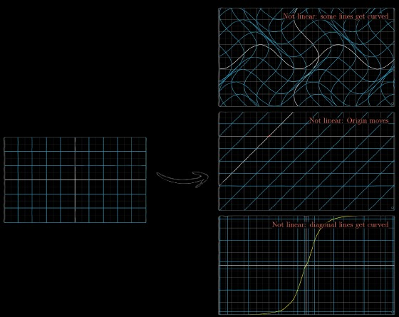
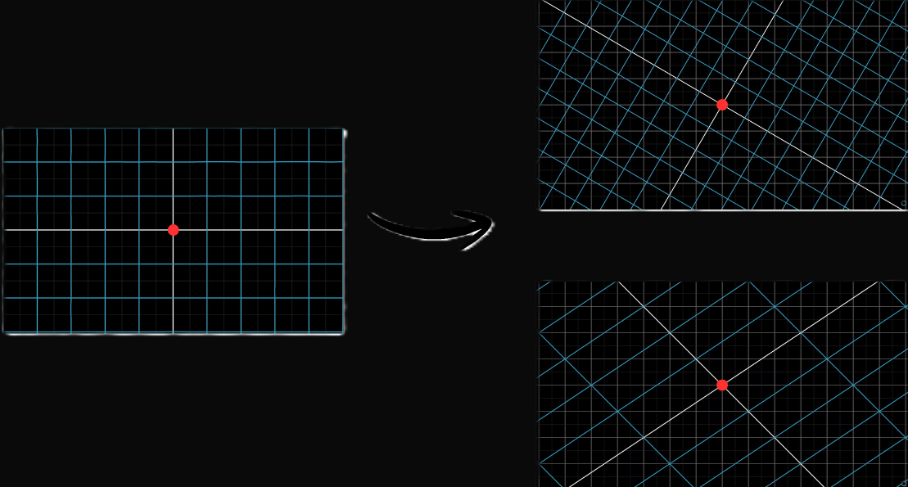
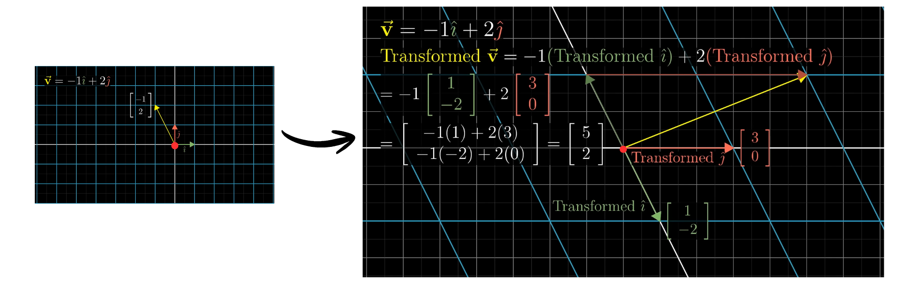
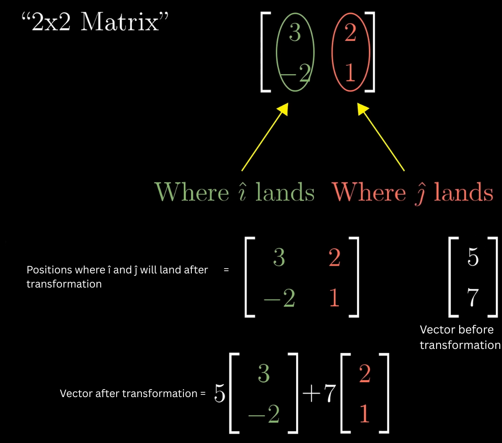

## Linear Transformation

Transformation simply means function, a function takes an input and gives some output. Similarly when a vector is change from its initial state(input) to a different state(output) it is called Transformation. Transformation can be done by moving the space on which the vector exist, hence moving the vector.

Transformation can be of any shape which makes things very complex but when we talk about linear its simpler.
Linear Transformation rules :
-  All Lines must remain lines without getting curved.
- origin must remain fixed in place.

  
In general, Linear Transformation the grid lines remain parallel and evenly spaced.

# how to describe a transformation numerically ?

When we do Linear Transformation the changes occur throughout the space equally. Hence if a vector before linear transformation was 
- $\vec{v} = -1\hat{i} + 2\hat{j}$  
  
or  
  
- $\vec{v} = \begin{bmatrix}-1\\2\end{bmatrix}$

After transformation the Linear combination remain changed yes the vector and basis vector change but the overall combination remain same
- Transformed $\vec{v}$ = -1(Transformed $\hat{i}$) + 2(Transformed $\hat{j}$)
 
Hence if we know where basis vectors $\hat{i}$ and $\hat{j}$ landed we can easily deduce where the transformed vector $\vec{v}$ landed.

> [! Important idea]
> We can know where the vector will land after transformation just by know where basis vectors $\hat{i}$ and $\hat{j}$ landed without visualizing the transformation.
> So in general if initially vector was at position $\vec{v} = \begin{bmatrix}x\\y\end{bmatrix}$ after transformation $\hat{i} =\begin{bmatrix}1\\-2\end{bmatrix}$  and $\hat{j}=\begin{bmatrix}3\\0\end{bmatrix}$ the new position of vector $\vec{v}$ will be : 
>$$
 \begin{bmatrix}
 x \\ y
 \end{bmatrix} = x\begin{bmatrix}
 1\\-2
 \end{bmatrix} + y\begin{bmatrix}
 3\\0
 \end{bmatrix} = \begin{bmatrix}
 1x + 3y \\ -2x + 0y
 \end{bmatrix}
$$

## Matrix

A Matrix is a rectangular grid or array of numbers, symbols, or expressions arranged in rows and columns. It is used to organize data and perform complex computations.
$$
	\begin{bmatrix}
	a&b\\c&d
	\end{bmatrix}
	\\
	\text{ This is a 2 x 2 matrix i.e, row x col}
$$

In our case for Linear Transformation we use this matrix to represent the transformed position of $\hat{i}$ and $\hat{j}$.

>[! Important]
>In general if we have a vector $\vec{v}=\begin{bmatrix}x\\y\end{bmatrix}$ and we do a Linear transformation where $\hat{i}$ and $\hat{j}$ final position is written in matrix as $\begin{bmatrix}a&b\\c&d\end{bmatrix}$
>
.png)
